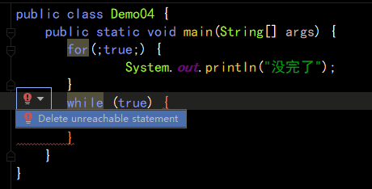

## 无限循环

```java
public class Demo04 {
    public static void main(String[] args) {
       for(;true;) {
               System.out.println("没完了");
       }
       while (true) {
           
       }
    }
}
```



死循环后面的代码会报错，显示，不能抵达的语句。


## 控制循环的流程关键字

### `break`

可以跳出循环，终止循环

只能用于循环或者switch

```java
public class Demo04 {
    public static void main(String[] args) {
       // 控制循环的流程关键字
        int i = 1;
        while (true) {
            System.out.println(i);
            if(i==100)  {
                // 终止
                break;
            }
            i++;
        }
    }
}
```


### `continue`

跳过本次循环

```java
public class Demo04 {
    public static void main(String[] args) {
       // 控制循环的流程关键字
        int i = 1;
        while (i<100) {
            // 自增
            i++;
            if(i>=20&&i<=80)  {
                // 跳过
                continue;
            }
            System.out.println(i);
        }
    }
}
```

