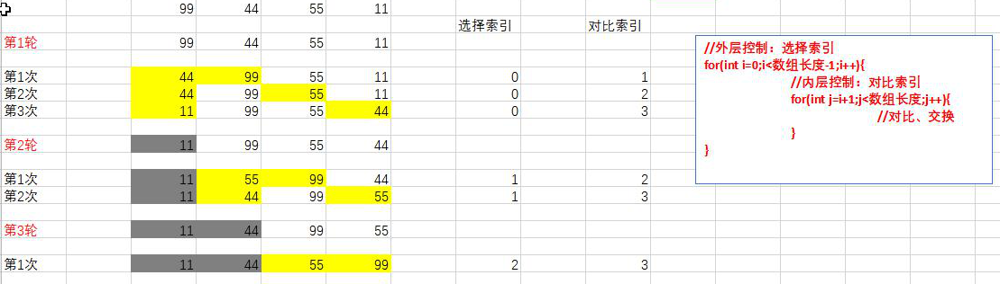

## 数组常见操作

* 正序快捷键：`arr.fori`
* 倒序快捷键：`arr.forr`

```java
public class Demo06 {
    public static void main(String[] args) {
        // 数组遍历
        int[] arr = {33, 44, 55, 66};
        // 正序遍历
        for (int i = 0; i < arr.length; i++) {
            System.out.println(arr[i]);
        }

        // 倒序遍历
        for (int i = arr.length - 1; i >= 0; i--) {
            System.out.println(arr[i]);
        }
    }
}
```


## 数组异常

### 空指令异常

数组为null，却强制访问

```java
        int[] list = null;
        System.out.println(list); //null
        System.out.println(list[0]); //NullPointerException
```


## 值交换

```java
        int a = 10;
        int b = 5;
        int temp = a;
        a = b;
        b = temp;
        System.out.println(a); // 5
        System.out.println(b); // 10
```


### 数组反转案例

```java
public class Demo08 {
    public static void main(String[] args) {
        int[] arr = {11,22,33,44,55,66,77};
        // 遍历数组长度一半的索引
        for (int i = 0; i < arr.length/2; i++) {
            // 将前后对应位置的指进行交换
            int temp = arr[i];
            arr[i] = arr[arr.length-i-1];
            arr[arr.length-i-1] = temp;
        }
        // 展示
        for (int i = 0; i < arr.length; i++) {
            System.out.println(arr[i]);
        }
    }
}
```


## 排序

### 冒泡排序

```java
public class Demo09 {
    public static void main(String[] args) {
        int[] arr = {99, 44, 55, 11, 22, 11};
        // 冒泡排序
        // 第几轮
        for (int i = 1; i < arr.length; i++) {
            // 每轮 从开始位置 排， 排到->上一轮的剩下需要排的位置
            // 第一轮  0 - 3  确定好最后一位
            // 第二轮  0 - 2  确定好倒数第二位
            for (int j = 0; j < arr.length - i; j++) {
                // 相邻元素 比较大小
                if (arr[j] > arr[j + 1]) {
                    // 交换位置
                    int temp = arr[j];
                    arr[j] = arr[j + 1];
                    arr[j + 1] = temp;
                }
            }
        }
        // 遍历
        for (int i = 0; i < arr.length; i++) {
            System.out.println(arr[i]);
        }
    }
}
```


### 选择排序



选择指定位置进行逐一对比交换

```java
public class Demo10 {
    public static void main(String[] args) {
        int[] arr = {99, 44, 55, 11};
        // 选择排序
        // 第一轮确定第一个位置
        for (int i = 0; i < arr.length-1; i++) {
            // 遍历其余所有位置
            for (int j = i+1; j < arr.length; j++) {
                // 让第一个位置和所有其余位置相比
                if(arr[i] > arr[j]) {
                    // 依次排序好每个位置 (从第一位依次确定)
                    int temp = arr[i];
                    arr[i]= arr[j];
                    arr[j]= temp;
                }
            }
        }

        // 遍历
        for (int i = 0; i < arr.length; i++) {
            System.out.println(arr[i]);
        }
    }
}
```

