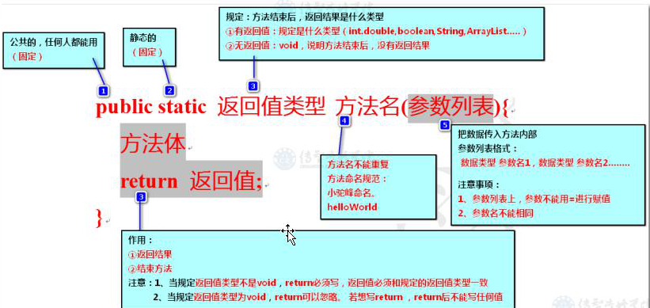

## 方法/函数

#### 格式



一个方法是属于某个类的一个功能，所以<font color=red>方法必须定义在对应的类中</font>

```java
public class Demo01 {
    public static void main(String[] args) {

    }
    /**
     *  控制台展示公式
     *  没有返回结果 void 无返回值
     *  没有参数列表：不需要从外界传入数据
     */
    public  static void  show() {
        System.out.println("圆的面积=半径*半径*Π");
    }
    /**
     * 返回Π
     * 有返回值：double 方法执行结束，会有小数结果进行返回
     * 没有参数列表，不需要从外界传入数据
     * 注意：方法只要有返回值，在方法体末位必须使用return进行返回值
     */
    public  static  double getPI() {
        return 3.14159265;
    }
    /**
     * 返回俩个整数的加法结果
     * 有返回值：int
     * 有参数列表：俩个参数（int）
     */
    public  static int getSum(int num1, int num2) {
        return  num1 + num2;
    }
}
```

#### 方法格式：

```
publick static 返回值类型 方法名（参数列表） {
	方法体
	return 值
}
```

### 方法调用

#### 普通调用：

在其它类中也可以这样调用

<font color=red>调用格式：`类名.方法名（参数）`</font>

#### 本类内部调用：

当一个类中有多个方法，多个方法之间可以调用

<font color=red>调用格式：`方法名（参数）`</font>

#### 小结：

* 方法调用时，方法的定义位置不会影响方法的调用
