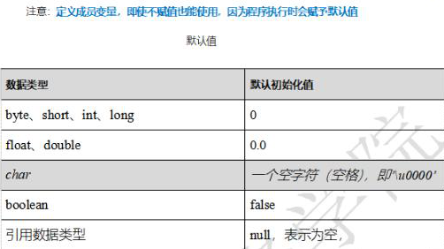
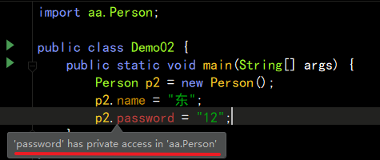
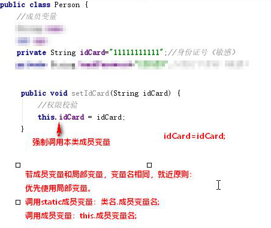

### String 案例

#### 转大小写的方法

```
public class Demo01 {
    public static void main(String[] args) {
        System.out.println(turnUpper("aBc", false));
    }

    public static String turnUpper(String str, Boolean flag) {
        return  flag ? str.toUpperCase(): str.toLowerCase();
    }
}
```

#### 将字符串中不是a或A的字符都转大写

```java
public class Demo01 {
    public static void main(String[] args) {
        System.out.println(returnNewStr("abcab"));
    }

    public  static  String returnNewStr(String str) {
        // 先转为字符数组
        char[] arr = str.toCharArray();
        // 遍历
        for (int i = 0; i < arr.length; i++) {
            if (arr[i] != 'a' && arr[i] != 'A') {
                // 将需要改变的字符，转为大写
                // 方式一
				//arr[i] = Character.toUpperCase(arr[i]);
                // 方式二
                String temp = arr[i] + "";
                temp = temp.toUpperCase();
                arr[i] = temp.charAt(0);
            }
        }
        // 将字符列表转为字符串，返回
        return new String(arr);
    }
}
```


## 类

### 概念

<font color=red>一个类就是一个引用数据类型</font>（一个Java文件，就是一个类）

学习Java，就是学习各种类如何创建，如何使用

### 基本创建方式

一个完整的Java类至少由俩部分组成：

1. 成员变量：<font color=red>保存信息</font>
2. 成员方法：<font color=red>各种功能</font>

```java
public class Person {
    // 成员变量
    public int age = 10;
    // 成员方法
    public void eat() {
        System.out.println("吃");
        // 成员方法中可以直接访问静态方法
        fn1();
    }
    public static void fn1() {
        System.out.println("方法");
    }
}
```

```java
public class Demo02 {
    public static void main(String[] args) {
        // 静态 方法调用
        Person.fn1();
        
        // 成员 方法调用
        Person p1 = new Person();
        p1.eat();
    }
}
```

#### 注意：

* 成员不要加static关键字（<font color=red>非静态成员方法、变量都必须依赖具体的对象才能够被调用</font>）
* 定义成员变量，即使不赋值也能使用，因为程序执行时<font color=red>会赋予默认值</font>



```java
public class Guy {
    // 不赋值
    public int age;
    public String name;
}

public class Demo03 {
    public static void main(String[] args) {
        Guy g = new Guy();
        // 会有默认值
        System.out.println(g.age); // 0
        System.out.println(g.name); // null
    }
}
```


### 类的基本使用方式

Java类的简单使用方式，就是我们之前学过的引用数据类型的使用方式

* <font color=red>import 导包</font>

* <font color=red>创建对象</font>

  格式：<font color=red>`类名 对象名 = new 类名();`</font>

```java
// 导包
import aa.Person;

public class Demo02 {
    public static void main(String[] args) {
        // 创建对象
        Person p2 = new Person();
    }
}
```


#### 注意：

* 只有引用数据类型的变量名能够叫做对象名
* 基本数据类型的变量名只能叫做变量名
* <font color=blue>Java类只有先创建对象以后，才能够使用类中的所有功能</font>

### 使用Java类的成员变量

* 为成员变量赋值：<font color=red>`对象名.成员变量 = 值`</font>
* 获取成员变量值：<font color=red>`其他变量 = 对象名.成员变量`</font>

```java
public class Guy {
    public int age;
    public String name = "家伙";
}

public class Demo03 {
    public static void main(String[] args) {
        Guy g = new Guy();
        // 赋值
        g.age = 18;
        System.out.println(g.age); // 18
        // 获取
        System.out.println(g.name); // 家伙
    }
}
```


### 类创建 及 类使用的注意事项

默认成员变量和方法是外界随意调用的（相当于public）

* 但是为了<font color=red>安全起见</font>，成员变量的规范定义方式<font color=red>都会使用private修饰</font>

成员变量使用private修饰，这样该成员变量只有在该类内部可以用，外界无法使用

```java
package aa;

public class Person {
    // 姓名 (默认外界随便使用)
    public String name;
    // 银行卡密码 (私有化)
    private String password;
}
```



```java
import aa.Person;

public class Demo02 {
    public static void main(String[] args) {
        Person p2 = new Person();
        p2.name = "东";
//        p2.password = "12";  // 报错：私有
    }
}
```

**如果外界需要获取或修改成员变量，则需要提供对应的<font color=red>get/set方法</font>** 

提示：使用快捷键 `alt + insert`

```java
public class Guy {
    private int age;
    private String name = "家伙";
    // 通过 get 方法获取
    public int getAge() {
        // 未来 在这里 校验权限
        return age;
    }
    // 通过 set 方法赋值
    public void setAge(int age) {
        // 未来 在这里 校验权限
        this.age = age;
    }
}

public class Demo03 {
    public static void main(String[] args) {
        Guy g = new Guy();
        // 设置
        g.setAge(19);
        // 获取
        int age = g.getAge();
        System.out.println(age); // 19
    }
}
```


#### 修饰符说明

* <font color=purple>private 意思是私有的，只有在本类内部使用</font>
* <font color=purple>public 意思是共有的，任何地方都可以调用</font>



#### 注意：

* 如果成员变量和局部变量，变量名相同，就近原则，优先使用局部变量
* 想要指定static成员变量：`类名.成员变量名`
* 想要指定成员变量：`this.成员变量名`

```java
public class Stuff {
    public static String str = "我是静态成员变量";
    private String str2 = "我是成员变量";
    public void run() {
        System.out.println(str); // "我是静态成员变量"
        String str = "我是局部变量";
        System.out.println(str); // "我是局部变量"
        System.out.println(this.str2); //  我是成员变量
    }
}
```


### 封装

将类的属性和功能结合为一个独立的整体，并尽可能隐藏类的内部实现细节

1. <font color=red>private所有成员变量</font>
2. <font color=red>每个private成员都有 `get/set` 方法</font>

