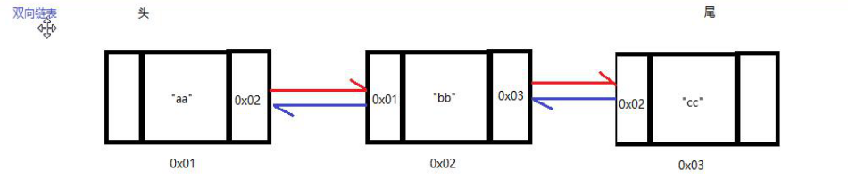
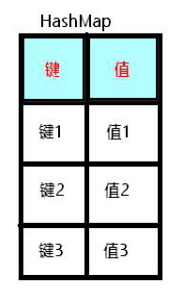

## 集合

### 概述

集合：用来保存 相同类型数据的容器，除了保存数据，又集成了较多强大的功能

我们会在下面的学习过程中，逐个学习以下集合：`ArrayList`、`LinkedList`、`HashSet`、`HashMap`

### ArrayList进阶

ArrayList是开发中最常用的集合

该集合因为使用索引，所以查找速度极快。

用于进行数据存储和数据的获取、遍历

#### 方法

* <font color=red>`add(int index, 元素类型 e)`</font>

  向指定索引位置添加元素

  注意：

  * 元素越多，添加越慢（因为ArrayList数组的特性）
  * 该索引必须存在，否则报错

* <font color=red>`remove(int index)`</font>

  删除某个索引位置的元素

```java
import java.util.ArrayList;
import java.util.Collections;

public class Demo05 {
    public static void main(String[] args) {
        // 创建ArrayList
        ArrayList<Integer> list = new ArrayList<>();
        Collections.addAll(list, 1,2,3,4);
        System.out.println(list); // [1, 2, 3, 4]
        // 使用add 在索引为2的位置添加元素 99
        list.add(2, 99);
        System.out.println(list); // [1, 2, 99, 3, 4]
        // 使用remove 删除索引为3的元素
        list.remove(3);
        System.out.println(list); // [1, 2, 99, 4]
    }
}
```


#### 增强 for 循环

增强for循环是完成集合迭代的简化方式

**格式：**

```java
for (元素数据类型 变量: 容器or数组) {
	// 循环体
}
```

```java
import java.util.ArrayList;
import java.util.Collections;

public class Demo06 {
    public static void main(String[] args) {
        ArrayList<Integer> list = new ArrayList<>();
        Collections.addAll(list, 1,2,3,4);
        // 增强for循环
        // 遍历
        for (Integer val : list) {
            // val 是每次循环的元素
            System.out.println(val);
        }
    }
}
```

##### 注意：

- 普通for循环：可以进行倒序遍历，可以在遍历中通过add添加元素，可以通过remove删除元素
- 增强for循环：<font color=red>只能正向遍历，不可以在遍历中进行元素增删操作</font>。（否则报错）


### `LinkedList` 链表

**链表**

创建方式与 ArrayList 相似

```java
 LinkedList<String> strings = new LinkedList<>();
```

#### 结构：



<font color=red>区别于数组：没有索引</font>

#### 常用API：

* **`void addFirst(E e)`**  

  向链表的开头插入一个元素，相当于`list.add(0, e)`

  ```java
          LinkedList<String> list = new LinkedList<>();
  		// 添加
          list.addFirst("first");
          System.out.println(list); // [first]
  		// 利用索引添加也可以，但是对于没有索引的LinkedList来说，效率较低，不推荐
          list.add(1,"1");
          System.out.println(list); // [first, 1]
  ```

* **`void addLast(E e)`**

  向链表的尾部插入一个元素，相当于`list.add(list.size(), e)`

  ```java
  list.addLast("Last");
  ```

*  **`E getFirst()`**

  从链表中获得第一个元素

  ```java
  LinkedList<String> list = new LinkedList<>();
  String first = list.getFirst();
  ```

* **`E getLast()`**

  从链表中获得最后一个元素

  ```java
  LinkedList<String> list = new LinkedList<>();
  last = list.getLast();
  ```

* **`E removeFirst()`**

  移除链表中的第一个元素，并返回移除的元素

* **`E removeLast()`**

  移除链表中的最后一个元素，并返回移除的元素
  
  ```
  System.out.println(list); // [first, 1, Last]
  
  list.removeFirst();
  System.out.println(list);  // [1,last]
  list.removeLast();
  System.out.println(list);  // [1]
  ```

#### 小结：

<font color=red>链表仅能提供头、尾操作。没有索引操作（索引操作的底层实现方法需要模拟索引，会导致效率极低）</font>

#### 遍历

只能使用增强for循环

```java
import java.util.Collections;
import java.util.LinkedList;

public class Demo03 {
    public static void main(String[] args) {
        LinkedList<String> list = new LinkedList<>();
        Collections.addAll(list,"a","b","c");
        // 遍历
        for (String s : list) {
            System.out.println(s);
        }
        // 使用ArrayList方法，操作LinkedList
        // LinkedList没有索引，强制使用索引方式进行操作，
        // LinkedList虽然支持，但是底层是模拟索引进行的，效率极低
        System.out.println(list.get(2));
    }
}
```

#### `ArrayList` 和 `LinkedList` 的区别

* `ArrayList`底层是数组，有索引。<font color=red>查找速度极快，增删速度低（查询）</font>

  ArrayList做增删时，需要重新赋值一份新数组，然后再添加进新元素，再把原来的删掉

* `LinkedList`底层是链表，没有索引。<font color=red>增删速度高，查找速度很低（增删）</font>

  LinkedList做增删时，只需要处理一下首尾元素

  

### `HashSet` 哈希集合

<font color=red>HashSet集合不能存放重复元素</font>

用来存储如：身份证号、商品货号等

#### 注意：

* HashSet 集合<font color=blue>无索引</font>（所以不能直接对指定元素定位）
* HashSet 集合<font color=blue>迭代元素的顺序与存储元素的顺序无关</font>

#### 常用方法：

* **`int size()`**

  返回集合中元素的个数

  ```java
  HashSet<String> hSet = new HashSet<>();
  Collections.addAll(hSet, "袁", "旭", "东");
  System.out.println(hSet); //  [袁, 东, 旭]   是无序的
  // 获取元素个数
  System.out.println(hSet.size());  // 3
  ```

* **`boolean isEmpty()`**

  判断集合是否为空

  ```java
  System.out.println(hSet.isEmpty());
  ```

* **`boolean add(E e)`**

  向集合中添加元素

  ```java
  hSet.add("frank");
  System.out.println(hSet); // [frank, 袁, 东, 旭]
  ```

* **`boolean remove(Object o)`**

  将指定对象从集合中移除

  ```java
  hSet.remove("旭");
  System.out.println(hSet); // [frank, 袁, 东]
  ```

* **`void clear()`**

  清空集合中所有成员
  
  ```java
  hSet.clear();
  System.out.println(hSet); // []
  ```

**注意：** <font color=red>因为无索引，所以HashSet无法通过索引单独获取某个元素的常规方法</font>

#### 遍历

使用增强for循环

```java
        HashSet<String> hSet = new HashSet<>();
        Collections.addAll(hSet, "袁", "旭", "东");
        for (String s : hSet) {
            System.out.println(s);
        }
```

### Map 双列集合

#### 概念

<font color=red>Map集合叫做双列集合，每个元素都由“键”,"值"俩部分组成</font>



该集合记录的是<font color=blue>键值对，对应关系</font>

`ArrayList、LinkedList、Set` 都是单列集合

### HashMap 基本使用

HashMap 和 HashSet 一样，是<font color=red>无序的</font>（展示顺序和存放顺序可能不同）

#### Map（HashMap）的使用：

创建对象时<font color=red>要规定键和值的数据类型</font>

```java
HashMap<键, 值> 变量名 = new HashMap<>();
```

```java
HashMap<String, String> map1 = new HashMap<>();
```

#### 常用方法：

*  **`put(K key, V value)`**

  向集合中<font color=red>添加数据</font>

  添加成功，返回null

  若键重复，则新值覆盖旧值，将被覆盖的旧值返回

  ```java
  HashMap<String, String> hMap = new HashMap<>();
  String result = hMap.put("first", "one");
  System.out.println(result); // 返回 null  表示添加成功
  System.out.println(hMap); // {first=one}
  
  String resultAgain = hMap.put("first", "two");
  System.out.println(resultAgain); // one  返回旧值，表示新值覆盖旧值
  System.out.println(hMap); // {first=two}
  ```

  

* **`get(Object key)`**

  通过指定键key 获得值 value

  若获取不到，返回null

  ```java
  HashMap<String, String> hMap = new HashMap<>();
  hMap.put("first", "one");
  hMap.put("second", "two");
  System.out.println(hMap.get("second")); // two
  System.out.println(hMap.get("third")); // null
  ```

  

* **`remove(Object key)`**

  移除指定 key 对应的键值，并返回值

  返回null时，意味着删除失败

  ```java
  System.out.println(hMap.remove("second")); // two 返回被删除的值，表示成功
  System.out.println(hMap.remove("second")); // null 表示失败
  ```

* **`clear()`**

  清空集合

* **`size()`**

  集合中键值的个数

* **`isEmpty()`**

  集合是否为空

#### 遍历

```java
import java.util.HashMap;
import java.util.Map;

public class Demo03 {
    public static void main(String[] args) {
        HashMap<String, String> hMap = new HashMap<>();
        hMap.put("first", "one");
        hMap.put("second", "two");
        hMap.put("third", "three");

        // 方式一：
        // 通过 key 来获取 value
        // 快捷写法： map.keySet().for
        // keySet() 方法，可以将 map中的所有的key，转为一个Set集合返回给我们
        for (String key : hMap.keySet()) {
            // 拿到每个key之后，再用get获取key对应的value
            System.out.println(key + "--" + hMap.get(key));
        }

        // 方式二：
        // 通过键值对，直接把一个键值对的key和value获取到
        // map.entrySet()会把 每一对键值对封装在一个Set集合中返回
        for (Map.Entry<String, String> entry : hMap.entrySet()) {
            // Map.Entry 对象，有俩个方法： getKey() 获取键，getValue() 获取值
            System.out.println(entry.getKey()+"--"+entry.getValue());
            System.out.println(entry);
        }
    }
}
```


#### Map-value存储自定义类型

同其它集合一样，<font color=red>Map的key和value都可以存储自定义类型对象</font>

```java
package packageHashMap;

public class Person {
    private String name;
    private int age;

    public Person(String name, int age) {
        this.name = name;
        this.age = age;
    }

    @Override
    public String toString() {
        return "Person{" +
                "name='" + name + '\'' +
                ", age=" + age +
                '}';
    }
}
```

```java
package packageHashMap;

import java.util.HashMap;

public class Demo04 {
    public static void main(String[] args) {
        HashMap<String, Person> personMap = new HashMap<>();
        personMap.put("第一个", new Person("frank", 22));
        personMap.put("第二个", new Person("link", 12));
        personMap.put("第三个", new Person("drink", 23));

        Person result = personMap.get("第二个");
        System.out.println(result); // Person{name='link', age=12}
    }
}
```

##### 建议：

1. 使用<font color=red>value</font>存储自定义对象
2. <font color=red>key使用基本数据类型或String</font>


