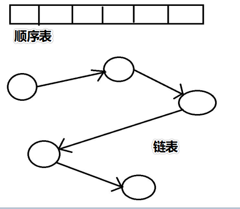
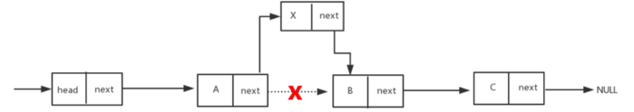
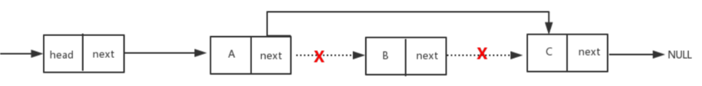
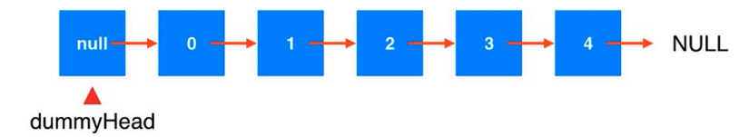

### 空间复杂度

全称是<font color=red>渐进</font>空间复杂度

表示算法<font color=red>占用的存储空间</font>与<font color=red>数据规模</font>之间的<font color=red>增长关系</font>

#### 示例：

* O(n)

  ```java
      // 空间复杂度 O(n)
      void print(int n) {
          int i = 0;
          int[] arr = new int[n];
          for (i = 0; i < arr.length; i++) {
              arr[i] = i* i;
          }
      }
  ```

  

## 链式存储结构

物理空间上<font color=red>可以不采用连续的区域存储</font>，通过<font color=red>指针的指向</font>，<font color=red>连接</font>前后的元素


### 特点：

* 第一个结点叫做<font color=red>头结点</font>，头结点用来记录<font color=red>链表的基地址</font>，有了它，我们才可以遍历得到整条链表
* 最后一个结点叫做<font color=red>尾结点</font>，尾结点特殊的地方是：指针不是指向下一个结点，而是<font color=red>指向一个空地址NULL</font>，表示这是链表上最后一个结点

### 顺序表和链表的区别（ArrayList和LinkedList的区别）



1. 顺序表的<font color=#ec0000>物理空间</font>是<font color=#ec0000>连续的</font>，链表的物理空间<font color=#ec0000>不连续</font>

2. 顺序表的<font color=#ec0000>底层</font>是<font color=#ec0000>静态数组</font>，他的<font color=#ec0000>动态是靠重新创建新的数组</font>，链表是真正的<font color=#ec0000>动态数据结构</font>

3. 链表的<font color=#ec0000>新增</font>和<font color=#ec0000>删除</font>效率比较<font color=#ec0000>高</font>

   

   

   

   顺序表的<font color=#ec0000>查询</font>效率比较<font color=#ec0000>高</font>（因为顺序表只有一个地址，然后通过索引查到即可；链表需要从头结点开始通过地址线查找）


#### 链表实现：

<font color=red>数据存储在结点（Node）中</font>

```java
// 结点
class Node {
	// 数据 元素
	E e;
	// 下一个 节点
	Node next;
}
```

#### 创建链表

```java
/**
 * 手写 链表
 * @param <E> 元素类型
 *
 * 1.创建结点Node：
 *           a. 元素 e
 *           b. next 下一个结点
 * 2.创建LinkedList链表（链表上的一个个元素称为结点，结点是组成链表的基本单位）
 *           a. 头节点 head
 *           b. size 链表上元素的个数
 */
public class LinkedList<E> {
    // 使用内部类创建结点类
    private class Node {
        // 元素
        public E e;
        // 下一个节点
        public Node next;
        // 无参构造
        public Node() { }
        // 有参构造
        public Node(E e, Node next) {
            this.e = e;
            this.next = next;
        }

        @Override
        public String toString() {
            return e.toString();
        }
    }

    // 头结点
    private Node head;
    // 尾结点
    private Node end;
    // 多少个元素
    private int size;

    // 获取链表长度
    public int getSize() {
        return size;
    }
    // 链表是否为空
    public boolean isEmpty() {
        return size == 0;
    }
}
```

##### 重写`toString()`方法

```java
    @Override
    public String toString() {
        String str = " [ ";
        // 独自推理的代码
//        if (head != null) {
//            Node nodes = head;
//            str += head + ",";
//            while(nodes.next!=null) {
//                nodes = nodes.next;
//                str += nodes+ (nodes.next!=null?",":"");
//            }
//        }
        
        // 思想：设定一个当前的，当前的初始值就是head（第一个），每次循环更新当前的
        // 设定一个遍历的当前结点，head为第一个
        Node cur = head;
        // 当前结点不为空 继续遍历
        while (cur != null) {
            // 先加上当前非空结点的内容
            str += cur + (cur.next != null ? " -> " : "");
            // 让当前结点的next成为下一次循环的当前节点
            cur = cur.next;
        }
        str += " ] ";
        // 返回
        return "LinkedList{" +
                str +
                ", size=" + size +
                '}';
    }
```

##### 在链表头部添加元素

```java
    /**
     * 头插法
     *
     * @param e
     */
    public void addFirst(E e) {
        // 创建新结点，让新结点指向head，并把新结点作为头结点
        head = new Node(e, head);
        // 维护size
        size++;
    }
```

##### 在链表中间添加元素

```java
    /**
     * 中间插入法
     *
     * @param index 指定索引位置
     * @param e
     */
    public void add(int index, E e) {
        // index 要合法
        if (index < 0 || index > size) {
            throw new RuntimeException("索引非法");
        }
        // index 是否是头尾
        if (index == 0) addFirst(e);
        if (index == size) {
            addLast(e);
        } else {
            // 找到要插入的位置的前一个结点
            Node prev = head;  // index 1
            // 要在 索引3 插入时，索引位置的前一个就是索引2，所以要找第三个元素，那就要从head .next 2次
            // 就要保证循环2次  1、2
            for (int i = 1; i < index; i++) {
                prev = prev.next;
            }
            // 把之前上一个位置的结点的后一个结点记录下来
            Node next = prev.next;
            // 让之前的上一个位置的结点的后一个为新结点，新结点的下一个为之前的下一个结点
            prev.next = new Node(e,next);
            // 维护size
            size++;
        }
    }
```

##### 在链表尾部添加元素

```java
    /**
     * 尾插法
     *
     * @param e
     */
    public void addLast(E e) {
        if (size == 0) {
            // 第一个元素 既是头元素也是尾元素
            this.head = new Node(e, null);
            this.end = this.head;
        } else {
            // 给尾元素添加下一个元素
            this.end.next = new Node(e, null);
            // 更新尾元素
            this.end = this.end.next;
        }
        // 维护size
        size++;
    }
```

##### 设置虚拟头节点



在链表的操作中，通常会设置一个假的头结点，通常称为<font color=red>虚拟头结点</font>

虚拟头结点，里面<font color=red>不用存放元素</font>，只是它的<font color=red>next指向</font>真正的链表中的<font color=red>第1个元素</font>

* 头结点改为虚拟头结点
* 添加构造方法，在构造时，让虚拟节点为一个`new Node()`
* 将之前用到head的地方都改为 `dummyHead.next`

```java
/**
 * 手写 链表
 *
 * @param <E> 元素类型
 *            <p>
 *            1.创建结点Node：
 *            a. 元素 e
 *            b. next 下一个结点
 *            2.创建LinkedList链表（链表上的一个个元素称为结点，结点是组成链表的基本单位）
 *            a. 头节点 head
 *            b. size 链表上元素的个数
 */
public class LinkedList<E> {
    // 使用内部类创建结点类
    private class Node {
        // 元素
        public E e;
        // 下一个节点
        public Node next;

        // 无参构造
        public Node() {
        }

        // 有参构造
        public Node(E e, Node next) {
            this.e = e;
            this.next = next;
        }

        @Override
        public String toString() {
            return e.toString();
        }
    }

    // 头结点（改为虚拟结点）
    private Node dummyHead;
    // 多少个元素
    private int size;

    // 尾结点
    private Node end;

    // 获取链表长度
    public int getSize() {
        return size;
    }

    // 链表是否为空
    public boolean isEmpty() {
        return size == 0;
    }

    // 构造方法
    public LinkedList() {
        // 创建虚拟头结点
        this.dummyHead = new Node();
        this.size = 0;
    }

    /**
     * 头插法
     *
     * @param e
     */
    public void addFirst(E e) {
        // 虚拟头结点的next就是真正的头结点
        // 添加头结点
        // 并将虚拟头结点的之前记录的next指针接到新的头结点的next指针
        dummyHead.next = new Node(e, dummyHead.next);
        // 维护size
        size++;
    }

    /**
     * 中间插入法
     *
     * @param index 指定索引位置
     * @param e
     */
    public void add(int index, E e) {
        // index 要合法
        if (index < 0 || index > size) {
            throw new RuntimeException("索引非法");
        }
        // index 是否是头尾
        else if (index == 0) {
            // 往头插，使用头插法
            addFirst(e);
        } else if (index == size) {
            // 往尾插，使用尾插法，而且尾插法中会维护尾结点
            addLast(e);
        } else {
            // 找到要插入的位置的前一个结点
            // 从虚拟节点开始
            Node prev = dummyHead;
            // 找index-1位置的结点，循环index次，
            for (int i = 0; i < index; i++) {
                prev = prev.next;
            }
            // 把之前上一个位置的结点的后一个结点记录下来
            Node next = prev.next;
            // 让之前的上一个位置的结点的后一个为新结点，新结点的下一个为之前的下一个结点
            prev.next = new Node(e, next);
            // 维护size
            size++;
        }
    }

    /**
     * 尾插法
     *
     * @param e
     */
    public void addLast(E e) {
        if (size == 0) {
            // 第一个元素 既是头元素也是尾元素
            dummyHead.next = new Node(e, null);
            end = dummyHead.next;
        } else {
            // 给尾元素添加下一个元素
            end.next = new Node(e, null);
            // 更新尾元素
            end = end.next;
        }
        // 维护size
        size++;
    }

    @Override
    public String toString() {
        String str = " [ ";
        // 设定一个遍历的当前结点，head为第一个
        Node cur = dummyHead.next;
        // 当前结点不为空 继续遍历
        while (cur != null) {
            // 先加上当前非空结点的内容
            str += cur + (cur.next != null ? " -> " : "");
            // 让当前结点的next成为下一次循环的当前节点
            cur = cur.next;
        }
        str += " ] ";
        // 返回
        return "LinkedList{" + str +
                ", size=" + size +
                '}';
    }
}
```

