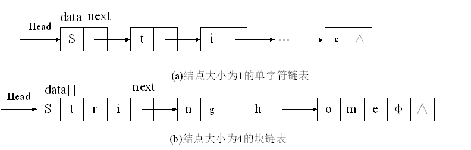
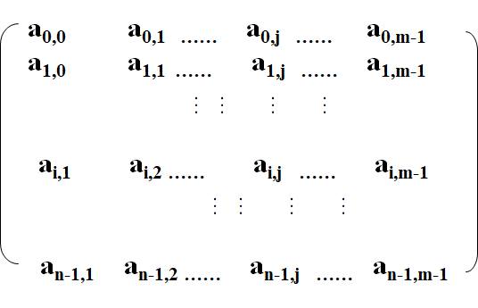
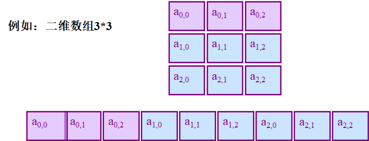

# 串

### 基本概念

* <font color=blue>**串**</font>：是由<font color=red>零个</font>或<font color=red>多个</font>字符组成的<font color=red>有限序列</font>

  一般记为 `s="a1a2....an"`，其中 `s` 为<font color=red>串名</font>，引号括起来的字符序列是<font color=red>串值</font>

  **串也是一种特殊的线性表**

* <font color=blue>**串的长度**</font>：串中<font color=red>字符的个数</font>

* <font color=blue>**空串**</font>：<font color=red>长度为0</font>的串，即不包含任何字符的串，表示为 `""`

* <font color=blue>**空白串**</font>：由一个或多个<font color=red>空白字符组成的串</font>，如：`"                  "`

* <font color=blue>**子串**</font>：串中任意一个连续字符组成的<font color=red>子序列</font>称为该串的子串

* <font color=blue>**主串**</font>：<font color=red>包含子串</font>的串<font color=red>相应</font>地成为主串

* <font color=blue>**字符在串中的位置**</font>：字符在串中的<font color=red>序号值</font>

* <font color=blue>**子串在主串中的位置**</font>：子串在主串中出现时，<font color=red>第一个字符</font>在主串中的<font color=red>序号值</font>

#### 注意：

* 要明白 空串与空白串 的区别
* <font color=red>空串是任意串地子串，任意串是其自身的子串</font>

### 基本操作

1. 串的置空操作：`clear()`
2. 串的判空操作：`isEmpty()`
3. 求串的长度操作：`length()`
4. 取字符元素操作：`charAt(index)`
5. 截取子串操作：`substring(begin, end)`
6. 插入操作：`insert(offset, str)`
7. 删除操作：`delete(begin, end)`
8. 串的连接操作：`concat(str)`
9. 串的比较操作：`compareTo(str)`
10. 子串定位操作：`indexOf(str, begin)`

### 存储结构

* 顺序存储结构
* 链式存储结构

#### 顺序存储结构

与线性表的顺序存储结构类似，可以<font color=red>采用一组地址连续的存储单元</font>来存储串字符序列

顺序存储的串称为<font color=red>顺序串</font>

```java
public class SeqString implements IString{
    private char[] strvalue; // 存放 串指
    private int curlen; // 存放 串的长度
}
```

#### 链式存储结构

链式存储可以有 <font color=red>单字符链表</font> 和 <font color=red>块链表</font>




## 模式匹配

通俗来讲，就是查询过程

设 `s`, ` t` 是两个串，`s="s1s2...sn"`，`t="t1t2...tm"` ` (0<=m<=n)`

<font color=red>在 `s`串 中寻找等于 `t`串 的子串</font>，这个<font color=red>过程</font>称为 **模式匹配**

其中 `s` 串称为主串，`t`串称为<font color=red>模式串</font>

**模式匹配是各种串处理系统中最重要的操作之一**

#### 实现：

* 匹配成功：返回 `t` 在 `s` 中首次出现的序号
* 匹配不成功：返回 `-1`

### 算法：

#### 简单算法（BF算法）

Brute-Force模式匹配算法，也就是暴力匹配

##### 思想：

将目标串S的第一个字符与模式串T的第一个字符进行匹配，
若相等，则继续比较S的第二个字符和 T的第二个字符； 若不相等，则比较S的第二个字符和T的第一个字符， 依次比较下去，直到得出最后的匹配结果。

BF算法是一种蛮力算法。

##### 时间复杂度：`O(m*n)`


#### KMP算法

由`D.E.Knuth`，`J.H.Morris`，`V.R.Pratt`提出的

##### 核心思想：

KMP算法的核心是利用匹配失败后的信息，尽量减少模式串与主串的匹配次数以达到快速匹配的目的。
具体实现就是通过一个next()函数实现，函数本身包含了模式串的局部匹配信息。

##### 时间复杂度：`O(m+n)`


# 数组

### 基本概念

数组是n个具有<font color=red>相同类型</font>的数据元素构成的<font color=red>有限序列</font>，并且这些数据元素占用一片<font color=red>地址连续</font>的内存单元。

`n` 称为数组的长度

<font color=red>一维数组</font>可以看成一个顺序存储结构的线性表

数组元素是一维数组的数组称为<font color=red>二维数组</font>，也称为<font color=red>矩阵</font>

### 二维数组/矩阵 的 基本概念



二维数组中的每一个数据元素 `a(i,j)` 都受到两个关系的约束：<font color=red>行关系</font>和<font color=red>列关系</font>


### 数组的顺序存储结构：

数组的顺序存储表示要解决的是一个 <font color=red>“如何用一维的存储地址来表示多维的关系”</font> 的问题

#### 有两种顺序映象的方式：

* 以**行序**为主序（行优先顺序）
* 以**列序**为主序（列优先顺序）

##### 行序为主序 的顺序存储映象：



如图所示，一行一行的存入一维数组的存储地址

二维数组 `A[m][n]` 中任一元素 `a(i,j)` 的**存储位置**为：

<font color=red>**`LOC(i,j)=LOC(0,0) + (n*i+j)*L`**</font>

`LOC` 为 `location` 缩写、`n`为二维数组有多少列、`i`为元素行索引、`j`为元素列索引、`L` 表示每个元素所需的存储单元的大小

`LOC(0,0)` 也称为数组的基地址或基址


### 特殊矩阵的压缩存储

如果在矩阵中有许多值相同的元素或者是零元素。为了<font color=red>节省存储空间</font>，可以对这类矩阵进行**压缩存储**

#### 压缩存储 概念：

为多个值<font color=red>相同</font>的元素<font color=red>只分配一个存储空间</font>；对<font color=red>零</font>元素<font color=red>不分配空间</font>

#### 特殊矩阵 概念：

具有<font color=red>许多相同数据元素或零元素</font>，且<font color=red>非零元素</font>在矩阵中的<font color=red>分布有一定规则</font>

例如：对称矩阵、三角矩阵、对角矩阵

