### 例题：

如果`Loc(0,0)` 的地址是100，每个元素占用6个空间，求元素为6的地址是多少

**解题思路：**

* 先明确行列数，也就是 m 和 n 的值
* 基地址 `Loc(0,0)`+ (列数n\*当前行索引i+当前列索引)*每个元素占用空间

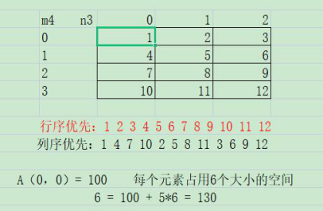

推导公式可以为：`n`为总列数，`i`为当前行索引，`j`为当前列索引，`L`为每个元素占用的空间

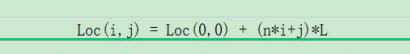

## 特殊矩阵

### 对称矩阵 的压缩存储

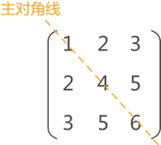

矩阵中有两条对角线，图中的对角线称为主对角线，另一条左下角到右上角的对角线为副对角线。对称矩阵指的是各数据元素沿主对角线对称的矩阵。

#### 特点：

* `A(i,j) = A(j,i)` 矩阵中对称位置的元素，经过压缩存储后，在顺序表中位置相同

#### 实现过程：

存储三角中的元素，只需将各元素所在的 行标`i` 和列标`j` 代入下面的公式

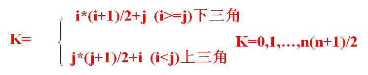

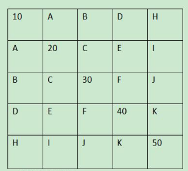

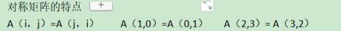

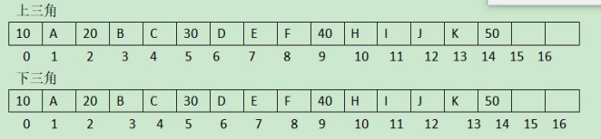

#### 注意：

* 上三角是以 **列序**优先 进行存储
* 下三角是以 **行序**优先 进行存储

### 上三角矩阵

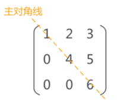 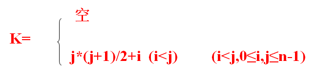  

**列序存储**

### 下三角矩阵

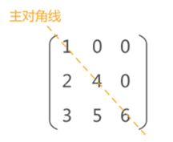 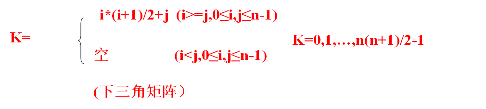

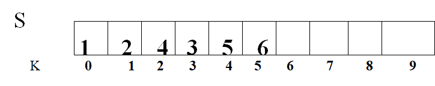

**行序存储**

### 稀疏矩阵

#### 定义：

有较多零元素，且非零元素分布无规律的矩阵为 **稀疏矩阵**

假设 `m` 行 `n` 列的矩阵含 `t` 个非零元素，则称

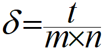 

为 **稀疏因子  δ**

通常认为：**`δ <= 0.05` 的矩阵 为稀疏矩阵，且零值元素分布是随机的**

### 稀疏矩阵的压缩存储

以二维数组表示高阶的稀疏矩阵时：

* 零元素会占很大空间
* 计算中进行了很多和零值的运算、遇到除法，还需要判别除数是否为零（导致计算效率不高）

所以，需要压缩存储 稀疏矩阵

##### 两种压缩存储方式：

* 三元组顺序表
* 十字链表

#### 三元组顺序表

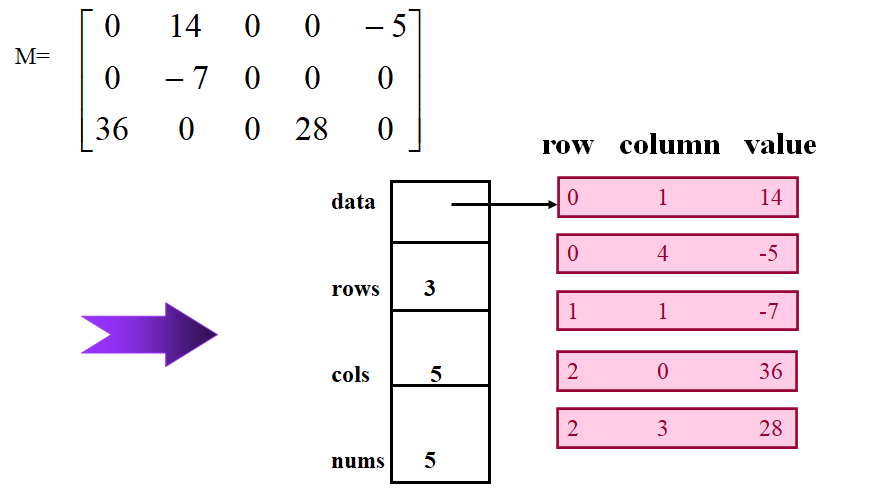 

每个结点要存储：

* 所在行
* 所在列
* 值
* 非零值数量

#### 十字链表

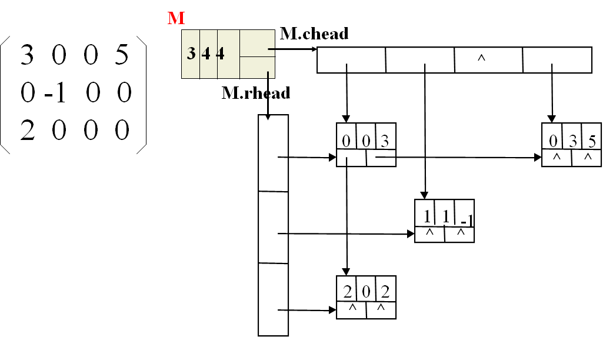 

