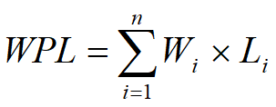
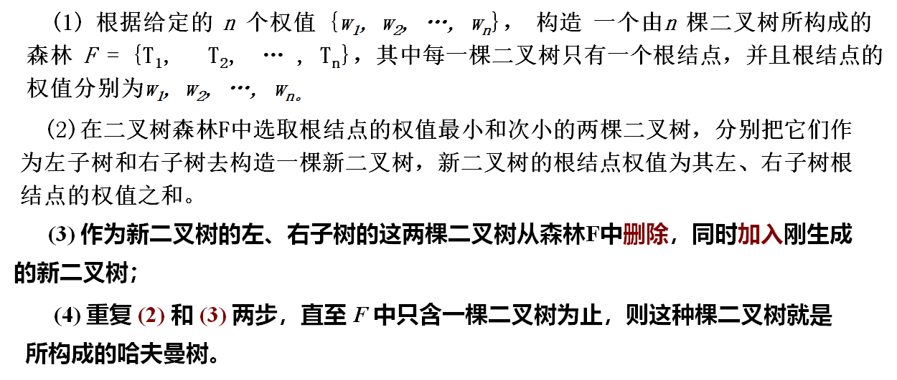
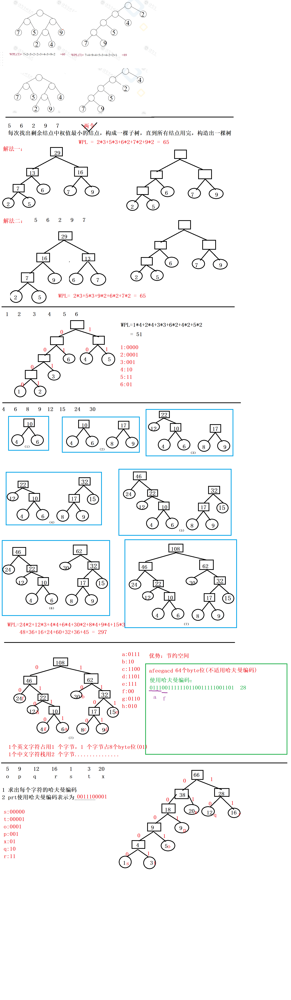

## 根据先根顺序和中根顺序

## 哈夫曼树（最优二叉树）

### 基本概念

结点间的路径：从一个结点到另一个结点所经历的结点和分支序列

结点的路径长度：从根结点到该结点的路径上分支的数目

结点的权：在实际应用中，人们往往会给树中的每一个结点赋予一个具有某种实际意义的数值，这个数值被称为该结点的权值

结点的带权路径长度：结点的路径长度与该结点的权值的乘积

树的带权路径长度：树中所有叶结点的带权路径长度之和。

假设树上有 n 个叶结点，通常记作：

 

其中 Li 为 带权Wi的叶子结点的带权路径长度

### 最优二叉树

#### 概念：

给定n个权值并作为n个叶结点，按一定规则构造一颗二叉树，使其带权路径长度达到最小值，则这棵二叉树被称为最优二叉树，也称为哈夫曼树

在所有含n个叶子结点、并带相同权值的二叉树中，必存在一颗其带权路径长度为最小值的树，这树就是最优树

#### 算法：

 

#### 使用哈夫曼编码

