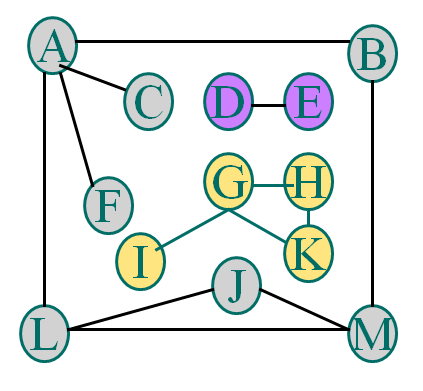

# 图

## 图的概述

### 基本概念

图中的每一个元素我们称为顶点（Vertex），并且图中的一个顶点可以于与其它任意顶点建立连接关系，我们把这种建立的关系叫做边（Edge）

图可以分为有向图，无向图，对应有向边和无向边

由顶点集和边集组成

记为 `G=(V, E)` 其中V是有穷非空集合，称为顶点集，v∈V 称为顶点

E是有穷集合，称为边集，e∈E称为边

#### 无向图

* 无向边
  * e = (u,v)=(v,u)，其中u, v ∈ V
  * 边（u,v）与边（v,u）是相同的
* 无向图
  * 全部由无向边构成的图

#### 有向图

* 有向边

  * e = <u, v>，其中 u,v ∈ V，简称为 弧（Arc）
  * 其中u为 始点 或 弧尾，v为 终点 或 弧头
  * 边<u,v> 和 边<v,u> 是不同的

* 有向图

  全部由有向边构成的图

#### 权（Weight）

* 在一个图中，每条边可以标上具有某种含义的数值，此数值称为该边上的权
* 通常，权是一个非负实数
* 权可以表示从一个顶点到另一个顶点的距离、时间、或代价等含义

#### 网（Network）

边上标识权的图称为网

 

#### 完全图

任意两个顶点之间都有边

* 完全无向图

  每两个顶点之间都存在着一条边

* 完全有向图

  每两个顶点之间都存在着相反的两条边

假设一个图中有n个顶点，e条边，则：

* 完全无向图含有 e = n(n-1)/2 条边
* 完全有向图含有 e = n(n-1) 条弧

#### 稠密图 和 稀疏图

若边或弧的个数 `e < nlog2n`，则称为稀疏图，否则称为 稠密图

n：顶点数量，e：边的数量

#### 子图

* 子图

  设有两个图 G=(V, E) 和 G1 = (V1, E1)，若 V1是V的子集，即V1

* 生成子图

  包含原图中所有顶点的子图

#### 邻接点

* 在一个无向图中，若存在一条边(u, v)，则称为顶点 u 与 v 互为 邻接点。边(u, v) 是顶点 u 和 v 关联的边，顶点 u 和 v 是边(u, v)关联的顶点
* 在一个有向图中，若存在一条弧 <u, v> ，则称为顶点u邻接到v，顶点v邻接自u，弧<u,v> 和顶点u、v关联

#### 顶点的度

* 顶点的度是图中与该顶点相关联边的数目，记为 `D(v)`

* 若一个图有 n 个顶点和e条边，则该图所有顶点的度之和与边数满足如下关系

   

##### 无向图顶点的度 

定义为该顶点为一个端点的边的数目，即该顶点的边的数目，记为D(v)

##### 有向图顶点的度

* 顶点v的入边数目是该顶点的入度，记为ID(v)
* 顶点v的出边数目是该顶点的出度，记为OD(v)
* 顶点v的度等于它的入度和出度之和，即：`D(v)=ID(v)+OD(v)`

#### 路径

在一个图中，路径是从顶点u 到 顶点v 所经过的顶点序列

路径长度 是指该路径上边的数目

##### 初等路径

序列中顶点不重复出现的路径称为初等路径

#### 回路

第一个顶点和最后一个顶点相同的路径称为回路或环

##### 初等回路

除了第一个顶点和最后一个顶点之外，其余顶点不重复出现的回路

#### 网中的路径长度

在网中，从始点到终点的路径上各边的权值之和，称为路径长度

 

#### 连通图

若无向图中任意两个顶点之间都有路径相通，则称此图为连通图

 

#### 连通分量

若无向图为非连通图，则图中各个极大连通子图称为此图的连通分量

 

#### 强连通图

若有向图中任意两个顶点之间都存在一条有向路径，则称此有向图为强连通图

 

#### 强连通分量

非强连通图中，各个极大强连通子图称作它的强连通分量

 

#### 生成树

假设一个连通图有n个顶点和e条边，其中n-1条边和n个顶点构成一个极小连通子图，称该极小连通子图为此连通图的生成树

 

