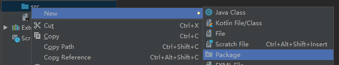
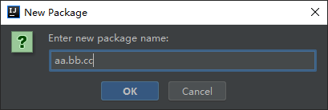
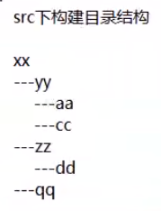
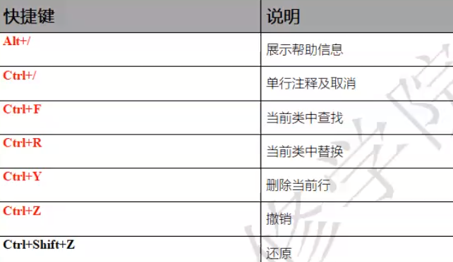
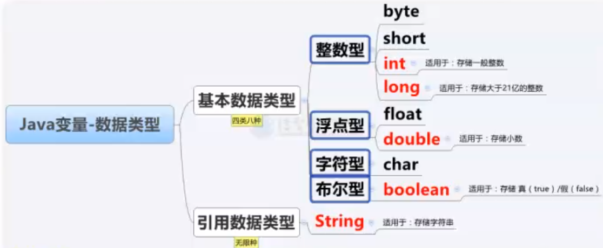

## Idea 自定义包

随着 Java 类越来越多，寻找和定位某个 Java类 将变得越来越难

##### src 里的子文件夹，我们叫做包

**作用：**用来规范、整理 src 下的 Java类存储

### 创建 包

#### 创建单个包



#### 创建多级包

使用 `.` 连接



包名规范：

* 禁止中文
* 全小写

#### 练习



先构建 `xx.yy.aa`， 然后创建 `xx.yy.cc`......


#### 注意：

如果某个包下仅有一个子包，默认是以 `.` 方式连接

如果有多个子包，就会以分支的方式展示


### Idea 常用快捷键



Ctrl+Alt+L 格式化

## 变量

### 概念

计算机内存中，用来反复 `存、取` 数据的区域，叫做变量

```java
public class Demo1 {
    public static void main(String[] args) {
        // 保存整数
        // 规定变量类型  为变量起名  在变量里保存数据
        int aa = 10;
        // 展示控制台
        System.out.println(aa);
    }
}
```


### 特殊方式定义变量

```java
public class Demo2 {
    public static void main(String[] args) {
        // 先定义，后赋值
        int aa;
        aa = 30;
        aa = 10;
        System.out.println(aa);
    }
}
```


### 一次定义多个变量

```java
public class Demo3 {
    public static void main(String[] args) {
        // 方式一：
        // 先一次定义多个，再依次赋值
        int a, b, c, d, e;
        a = 100;
        b = 200;
        c = 300;
        d = 400;
        e = 500;
        System.out.println(a);
        System.out.println(b);
        System.out.println(c);
        System.out.println(d);
        System.out.println(e);

        // 方式二：
        int f = 100, g = 200, h = 300, i = 400, j = 500;
        System.out.println(f);
        System.out.println(g);
        System.out.println(h);
        System.out.println(i);
        System.out.println(j);
    }
}
```


### 定义变量存储大整数

```java
public class Demo4 {
    public static void main(String[] args) {
        // 整形： 整数类型
        int zheng = 1000000000;
        // long长整型： 大整数类型 （注意后面要加 大写L）
        long da = 3000000000L;
        System.out.println(zheng);
        System.out.println(da);

        // byte 1字节  -128~127
        byte b = 0;
        // short 2字节  -32768~32767
        short s = 3000;
        // int 4字节  -2亿~2亿
        int i = 2000000000;
    }
}
```


### 定义变量存储小数

```java
public class Demo5 {
    public static void main(String[] args) {
        // 保存小鼠
        // double 4字节 双精度  精度是17位有效数字
        double aa = 100.99;
        System.out.println(aa);
        // float 8字节  单精度  精度是8位有效数字
        float bb = 100.99F;
        System.out.println(bb);
    }
}

```

开发中我们一般使用double保存小数


### 定义变量存储单个字符

需要使用Java中专门保存单个字符的变量类型：`char`

```java
public class Demo6 {
    public static void main(String[] args) {
        // char保存单个字符 2个字节 必须使用单引号
        char a1 = '曾';
        System.out.println(a1);  // 曾
        // 注意事项：若将单字符保存为整数，保存的是：
        // 该字符在计算机 文字表上的位置（码表上的位置）
        int a2 = '曾';
        System.out.println(a2);  // 26366

        // 还可以保存转义字符
        // 区别于普通计算机字符，需要通过\转义，转义字符相当于一个字符
        // TAB(制表符) \t
        char c3 = '\t';
        System.out.println(c3);
        char c4 = '\'';
        System.out.println(c4);
    }
}
```


### 定义变量存储多个文字

```java
public class Demo6 {
    public static void main(String[] args) {
        // String类型：字符串类型，专门用于保存多个字符
        // 必须使用双引号
        String s1 = "frank";
        System.out.println(s1);
        // 可以保存空字符
        String s2 = "";
        System.out.println(s2);
    }
}
```


### 定义变量存储布尔值

```java
public class Demo6 {
    public static void main(String[] args) {
        // 布尔值类型  1字节
        boolean f1 = true;
        System.out.println(f1);
        boolean f2 = false;
        System.out.println(f2);
    }
}
```


## 数据类型

基本数据类型和引用数据类型：

* 基本数据类型：用来保存数据
* 引用数据类型：用来保存数据，更多强大的功能

----

数据类型其实可以看作是有无数种的，因为我们每定义一个 Java类，意味着为Java提供了一种引用数据类型




### 数字类型变量的四则运算

```java
public class Demo7 {
    public static void main(String[] args) {
        int num = 10;
        num += 9;
        System.out.println(num);
        num -= 1;
        System.out.println(num);
        num *= 2;
        System.out.println(num);
        num /= 9;
        System.out.println(num);
    }
}
```


## 练习

1. 定义变量，保存小数10.55，使用变量除以5，运算结果再保存回变量，展示到控制台

   ```java
   public class Demo8 {
       public static void main(String[] args) {
           double num = 10.55;
           num /= 5;
           System.out.println(num);
           // 2.1100000000000003
       }
   }
   ```

2. 以下代码是否正确执行，效果是什么，效果是否准确

   ```java
   public class Demo8 {
       public static void main(String[] args) {
           int num = 5;
           num /= 2;
           // 因为int是整形
           System.out.println(num); // 2
   
           // 想要小数的话，要用小数接收
           int num2 = 7;
           double num3 = num2 / 3.0;
           System.out.println(num3); // 2.3333333333333335
       }
   }
   ```

3. 以下代码是否正确执行，效果是什么

   ```java
   public class Demo8 {
       public static void main(String[] args) {
           int num = 5;
           num = num / 0;
           // 报错，不可以除0
           System.out.println(num);
       }
   }
   ```

4. 以下代码执行效果是什么，控制台展示语句执行后，num1和num2的变量值是否发生改变

   ```java
   public class Demo8 {
       public static void main(String[] args) {
           int num1 = 10;
           int num2 = 20;
           System.out.println(num1 + num2); // 30
       }
   }
   ```

   