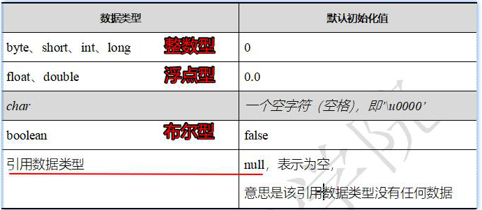

## 数组

* <font color=red>存入某个数组中的多个变量的数据类型必须一致</font>
* 语法：<font color=red>`数据类型[] 数组名 = new 数据类型[数组长度]`</font>
* java中数组的长度是固定的（数组<font color=red>在定义时，就要规定</font>：数组最多存储多少个数据）

```java
public class Demo04 {
    public static void main(String[] args) {
        // 数组
        int[] arr =  new int[2];
        System.out.println(arr.length);
    }
}
```

### 数组的多种定义方式

* 标准型 （如上）

  仅知道数组长度，不知道存储哪些数据时，使用

* 完整型

  ```java
  public class Demo04 {
      public static void main(String[] args) {
          // 完整型  默认长度为元素长度  3
          int[] arr2 = new int[]{11,22,33};
          System.out.println(arr2[0]);
      }
  }
  ```

  只有进行再次赋值时才使用 （再次赋值时不能使用简化赋值）

* 简化赋值型

  ```java
  public class Demo04 {
      public static void main(String[] args) {
          // 简化赋值型
          int[] arr3 = {1,2,3};
          System.out.println(arr3[2]);
      }
  }
  ```

#### 注意：

* char底层是int类型，所以char和int可以一起存储

  ```java
  public class Demo05 {
      public static void main(String[] args) {
          // 数字类型的数组中可以存 字符类型，值为字符码
          byte[] arr = new byte[]{'1', 0};
          System.out.println(arr[0]); // 49
  
          double[] doubles = new double[1];
          System.out.println(doubles[0]); // 0.0
          doubles[0] = '2';
          System.out.println(doubles[0]); // 50.0
      }
  }
  ```

  

* 数组内元素均有各自类型的默认值

  

  ```java
  public class Demo05 {
      public static void main(String[] args) {
          byte[] arr = new byte[1];
          System.out.println(arr[0]); // 0
  
          String[] str = new String[1];
          System.out.println(str[0]); // null
          // 引用数据类型的默认值都是null
  
          char[] chars = new char[1];
          System.out.println(chars[0]); // 一个空字符（空格）
  
          boolean[] flags = new boolean[1];
          System.out.println(flags[0]); // false
  
          double[] doubles = new double[1];
          System.out.println(doubles[0]); // 0.0
      }
  }
  ```


### Null值

null是所有引用数据类型可以接收的特殊类型，表示空，无数据

不能直接使用


## 数组的基本操作

### 获取某个元素，赋值某个元素

```java
        double[] doubles = new double[1];
        System.out.println(doubles[0]); // 0.0
        doubles[0] = 1;
        System.out.println(doubles[0]); // 1.0
```

#### 注意：

* 赋值：赋值内容必须符合数据类型要求
* 取值：取值索引必须存在