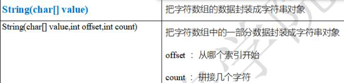
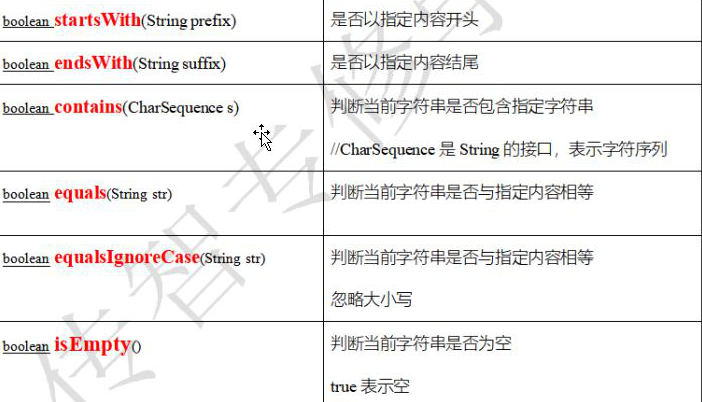
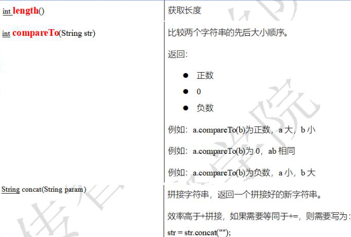

## 局部变量  成员变量

根据作用范围的不同，变量分为俩种

* 局部变量：

  定义在某个方法内的变量

  作用范围：仅在当前方法内部

  适用于：<font color=red>仅某个方法会使用到的变量</font>

* 成员变量：

  定义在类中、方法外的变量

  作用范围：在该类中的任意位置有效

  适用于：<font color=red>所有方法都需要使用到的变量</font>

```java
public class Demo01 {
    // 成员变量
    static int num = 0;

    public static void main(String[] args) {
        // 局部变量
        int num = 1;
        System.out.println(num);
        // 直属调用  类名.成员变量
        System.out.println(Demo01.num);
    }
}
```

就近原则，可以使用 直属调用的方式避开就近原则


## 字符串

### 概念

代表一个字符序列，其底层为字符数组

#### 所属包（特殊）：

<font color=red>`java.lang` 是特殊的，位于该包下的引用数据类型 可以 不导包直接使用</font>

#### 创建对象方式（特殊）：

```java
// 完整创建
String s = "xx";
// 快捷创建
String ss = new String("xx");
```


### 常见方法

##### 构造方法



* `String(char[] value)`
* `String(char[] value, int offset, int count)`

```java
public class Demo02 {
    public static void main(String[] args) {
        char[] arr = {'1', '1'};
        // 将char数组完整变成字符串
        String str = new String(arr);
        System.out.println(str);  // "1"

        // 将char数组，截取指定一段变为字符串
        String str2 = new String(arr, 1, 1);
        System.out.println(str2);
    }
}
```

#### 小结

1. 若仅需要对字符串进行创建保存，使用 `String 变量名 = "值"`
2. 若需要将字符数组转为字符串，使用 `new String(char[] value)`
3. 若需要将字符数组指定长度变为字符串，使用`new String(char[] value, int offset, int count)`
4. 创建新对象：`new String("")`


### 判断方法



#### `startWith(str)`

是否以指定内容开头

#### `endsWith(str)`

是否以指定内容结尾

#### `contains(字符序列)`

判断当前字符串是否包含指定字符串

#### `equals(str)`

判断当前字符串是否与指定内容相等

#### `equalsIgnoreCase(str)`

判断当前字符串是否与指定内容相等，忽略大小写

#### `isEmpty()`

判断当前字符串是否为空

```java
public class Demo03 {
    public static void main(String[] args) {
        String str = "helloWorld";
        System.out.println(str.startsWith("h")); // true
        System.out.println(str.endsWith("D")); // false
        System.out.println(str.contains("W")); // true
        System.out.println(str.equals("helloworld")); // false
        System.out.println(str.equalsIgnoreCase("helloworld")); // true
        System.out.println(str.isEmpty()); // false
    }
}
```


### 转换截取方法

<font color=red>String方法 不会改变原有字符串，方法都会返回新字符串</font>

#### `trim()`

去除两端空格

#### `toUpperCase()`

将所有字符变为大写字符

#### `toLowerCase()`

将所有字符变为小写字符

#### `substring(int start)`

截取包含 start索引的字符，直到最后

#### `substring(itn start, int end)`

截取start索引到end索引之前的字符

```java
public class Demo04 {
    public static void main(String[] args) {
        String str = " welcome to java ";
        System.out.println(str.trim());  // welcome to java
        System.out.println(str.toUpperCase()); //  WELCOME TO JAVA
        System.out.println(str.substring(4)); // come to java
        System.out.println(str.substring(2,3)); //e
        System.out.println(str.replace("to", "come to")); //  welcome come to java
    }
}
```


#### `replace(char oldChar, char newChar)`

替换原有字符串为新字符串

#### `toString()`

返回字符串本身

```java
        String str = " welcome to java ";
		// 直接打印时，相当于 将 str进行toString 然后打印
        System.out.println(str);
        System.out.println(str.toString());
```

#### `toCharArray()`

把字符串变为字符数组

```java
System.out.println(str.toCharArray()[2]);
```


#### `split(String)`

切割，以传入的分隔符为界限，返回字符串数组

```java
        String str1 = "abc.def";
        // 以 . 分割
        String[] arr = str1.split(".");
        // 得到 [] 空数组，是因为 . 代表所以
        System.out.println(Arrays.toString(arr));
        // 需要使用 \\ 来转义字符
        String[] arr1 = str1.split("\\.");
        System.out.println(Arrays.toString(arr1)); // [abc, def]
```

何时用转义字符切割：正常切割返回是空数组，说明正常切割失效，该符号应该为转义符号。


### 查找方法

#### `charAt(int index)`

返回指定索引位置的字符

#### `indexOf(String)`

返回指定字符串第一次出现的索引位置，找不到返回-1

#### `indexOf(String ch, int xx)`

从xx索引开始查找，指定字符串的索引位置，找不到返回-1

#### 

### 其它方法



#### `length()`

返回字符串长度

#### `compareTo(String)`

#### `concat(String)`

合并字符串

```java
public class Demo05 {
    public static void main(String[] args) {
        String str = "aaa";
        System.out.println(str.length()); // 3
        // 比较俩个字符串的先后大小顺序
        String s1 = "abc", s2 = "def";
        System.out.println(s1.compareTo(s2));  // -3 负数，s2更大

        // 拼接
        System.out.println(s1.concat(s2)); // abcdef
    }
}
```

