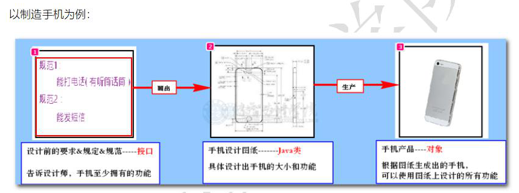

## 接口

Java世界中也有规范，为了学习Java中如何制定规范，我们就需要学习接口知识

### 概念

官方定义：<font color=red>接口是一系列方法的声明，是一些方法特征的集合</font>

也就是<font color=blue>把所需成员组合起来，用来装封一定功能的集合</font>。它好比一个**<font color=purple>模板</font>**，在其中定义了对象必须实现的成员，通过类或结构来实现它。

**接口**：用来<font color=red>定义规范、增强程序扩展性</font>



在 Java中，**<font color=red>`接口 = 规范`</font>**

### 定义接口

1. 接口定义时需要 <font color=red>`interface` </font>关键字

2. **格式：**

   ```java
   public interface 接口名 {
   	返回值类型 方法名(参数列表);
   }
   ```

   <font color=red>接口中普通成员方法（非静态成员方法）**无需方法体**</font>

   ```java
   // 将手机的设计规范定义为Java中的接口
   public interface Phone {
       // 手机可以打电话
       void call();
       // 手机可以发短信
       void sendMsg();
   }
   ```

#### 注意：

* <font color=red>抽象方法：没有具体的代码实现，只是定了规范而已</font>

### 实现接口 `implements`

接口无法直接创建对象

所以我们必须 **根据接口来定义普通Java类，使用普通Java类创建对象**

根据接口定义普通Java类，重写接口中方法的过程，我们称为：<font color=red>实现接口</font>

实现接口的普通Java类，我们也叫做 <font color=red>实现类</font>

#### 格式：

```java
public class 类名 implements 接口名 {
    // 重写接口中的方法
}
```

```java
// 使用 HWPhone 类 实现 Phone接口
public class HWPhone implements Phone {
    // 必须按照接口要求，实现方法
    @Override
    public void call() {
        System.out.println("华为手机打电话");
    }

    @Override
    public void sendMsg() {
        System.out.println("华为手机发短信");
    }
}
```

#### 注意：

* `@override` 注解，用来检查当前方法是一个重写方法，如果是重写方法一切正常，如果不是重写方法，会编译报错

* 实现接口的快捷方式 `alt + enter`

  ```java
  public interface A {
      // 选中接口名， 使用 alt + enter 快捷实现接口
  }
  ```

* 接口中 **不可以定义构造方法** ，更 **无法直接创建对象**

* 接口中不可以定义普通成员变量，只能定义常量。（接口中的常量默认被 `public static final` 修饰）

  ```java
  public interface A {
      // 定义常量
      String NAME = "frank";
  //    无需添加 public  static  final
  //    public  static  final String STR = "frank";
  }
  ```

* Java 支持一个类 <font color=red>实现多个接口</font>

  ```java
  public class BImplements implements A, B {
  }
  ```

* 接口中可以定义static 方法，<font color=red>static方法必须编写方法体</font>

  ```java
  public interface B {
      public static void run2() {
          System.out.println("run2");
      }
  }
  ```

* 接口中可以定义默认(default）方法，默认方法虽可以被重写，一般无需重写，可被实现类对象调用

  该<font color=red>默认方法用于：解决接口升级、实现类必须重写大量抽象方法 的 窘境</font>

  ```java
  public interface B {
      public static void run2() {
          System.out.println("run2");
      }
      // 默认方法和静态方法一样，要有方法体
      public default void run1() {
          System.out.println("run1");
      }
  }
  ```

  ```java
  public class Demo01 {
      public static void main(String[] args) {
          ABImplements abImplements = new ABImplements();
          // 使用实现类创建出来的对象，可以调用接口中的默认方法
          abImplements.run1();
      }
  }
  ```

  **注意** ：默认方法是可重写也可不重写的。

#### 总结：

* 接口不能直接创建对象，必须以来java类实现该接口，重写该接口里的抽象方法，才可以通过实现类创建对象

* 接口中，没有构造方法，没有普通变量（都是常量）

* 接口方法：

  * 普通抽象方法（必须被实现类重写）
  * 静态方法（拥有方法体，`接口名.方法名()`）
  * 默认方法（拥有方法体，只能创建对象调用，不是必须要重写的）

  ```java
  package packageThree;
  
  public interface Food {
      // 静态方法
      static void staticFn() {
          System.out.println("我是Food接口的静态方法，通过接口名访问");
      }
      // 抽象方法（通过 实现类去实现抽象方法）
      void abstractFn();
      // 默认方法
      default void defaultFn() {
          System.out.println("我是Food接口的默认方法");
      }
  }
  ```

  ````java
  package packageThree;
  
  public class Fruits implements Food {
      // 重写接口默认方法，可重写可不重写
      @Override
      public void defaultFn() {
          System.out.println("我是实现类重写的接口的默认方法");
      }
  
      // 重写接口抽象方法，必须重写
      @Override
      public void abstractFn() {
          System.out.println("我是实现类Fruits，实现了接口规定的抽象方法");
      }
  }
  ````

  ```java
  package packageThree;
  
  public class Demo03 {
      public static void main(String[] args) {
          Fruits apple = new Fruits();
          // 调用
          apple.defaultFn(); // 我是实现类重写的接口的默认方法
          apple.abstractFn(); // 我是实现类Fruits中，实现的接口规定的抽象方法
          Food.staticFn(); // 我是Food接口的静态方法，通过接口名访问
      }
  }
  ```

  

### 案例

#### 管理班级接口

定义管理班级接口

接口中定义俩个方法：作业检查，考试

定义班主任类，让班主任具备管理班级功能

定义讲师类，让讲师具备管理班级功能

注意：<font color=red>实现了哪个接口，我们就认为：类就具备了哪些功能</font>

```java
package packageOne;

// 管理班级接口
public interface Management {
    // 定义抽象方法
    void check();
    void exam();
}
```

```java
package packageOne;
// 实现讲师类
public class Lecturer implements Management {
    @Override
    public void check() {
        System.out.println("讲师检查作业");
    }

    @Override
    public void exam() {
        System.out.println("讲师考试");
    }
}
```

```java
package packageOne;
// 实现班主任类
public class ClassTeacher implements Management {
    @Override
    public void check() {
        System.out.println("班主任检查作业");
    }

    @Override
    public void exam() {
        System.out.println("班主任考试");
    }
}
```


#### 计算面积接口

```java
package packageTwo;
// 可计算接口
public interface Computable {
    // 抽象方法：计算面积的方法
    double area(double x);
}
```

```java
package packageTwo;

// 圆
public class Circle implements Computable {
    @Override
    // x 为半径
    public double area(double x) {
        return 3.14 * x * x;
    }
}
```

```java
package packageTwo;

// 正方形
public class Square implements Computable {
    @Override
    // x 为 边长
    public double area(double x) {
        return x * x;
    }
}
```

```java
package packageTwo;

public class Demo01 {
    public static void main(String[] args) {
        // 创建圆
        Circle circleOne = new Circle();
        // 计算面积
        System.out.println(circleOne.area(10)); // 314.0
        // 创建正方形
        Square squareOne = new Square();
        // 计算面积
        System.out.println(squareOne.area(10)); // 100.0
    }
}
```


