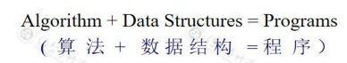
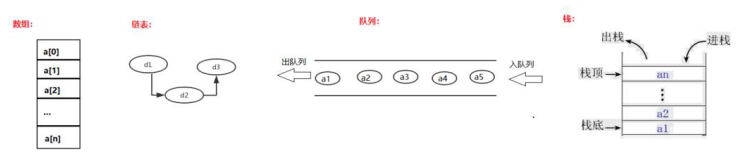

# 数据结构与算法

### 目标

1. 掌握线性表及其基本操作
2. 掌握线性表的顺序存储及其实现
3. 掌握线性表的链式存储及其实现
4. 了解时间复杂度

### 什么是数据结构

<font color=#c00000>是相互之间存在 一种或多种关系 的数据元素的集合</font>



<font color=red>数据结构：</font>问题的数学模型，它反映数据及其之间关系（存储结构和逻辑结构）

<font color=red>算法：</font>处理问题的策略（是对数据运算的描述，是程序的逻辑抽象）

<font color=red>程序：</font>为计算机处理问题而编制的一组指令集


#### 结构分类

* 逻辑结构：

  * 线性结构 `1:1`
  * 非线性结构：
    * 树形结构 `1:n`
    * 图状结构 `m:n`
    * 集合结构 `松散关系`

  

* 存储结构

  * 顺序存储：物理空间上采用连续区域存储，数组
  * 链式存储：物理空间上不连续，采用指针的指向，形成连续的存储区域
  * 索引存储
  * 散列存储：`map`

* 数据操作：创建、销毁、插入、删除、修改


## 线性表

所谓的线性表，就是将数据排成像一条长线一样的结构，数、链表、栈、队列都是线性表结构，线性表上的数据最多只有前后俩个方向

<font color=red>数据排成一条线一样的结构，注意此处我们并没有说是数据连续，线是直线等字眼</font>

非线性数据结构：树、图等



#### 线性表的特点：

1. 它由n个<font color=red>同类型</font>的元素组成
2. 每个元素除第一个元素和最后一个元素之外，有且<font color=red>仅有一个前驱和一个后继</font>
3. 其<font color=red>长度</font>可以<font color=red>动态</font>的增长或减少（支持动态扩容）
4. 可以对线性表中任何数据元素进行访问
5. 数据元素的插入和删除操作可以在线性表中的任何位置进行
6. 可以获取线性表中指定元素的前驱和后继

#### 线性表的存储结构

* 顺序存储结构：底层 是 数组
* 链式存储结构：底层 是 链表

顺序存储结构表示的线性表称为<font color=red>顺序表</font>

链式存储结构表示的线性表称为<font color=red>链表，链表又分为单链表、双向链表、循环链表</font>

#### 操作

1. 线性表的置空操作：`clear()`
2. 线性表判空操作：`isEmpty()`
3. 求线性表元素的个数：`length()、getSize()`
4. 求线性表的容量：`getCapacity()`
5. 取元素操作：`get(i)`
6. 插入操作：`insert(i,x)`
7. 删除操作：`remove(i)`
8. 查找操作：`indexOf(i)`
9. 输出操作：`toString()`

#### 数组的基本使用

```java
public class Main {
    public static void main(String[] args) {
        // 数组创建方式
        // 方式一
        int[] arr1 = new int[10];
        // 方式二
        int[] arr2 = new int[]{1, 2, 4};
        // 方式三
        int[] arr3 = {1, 2, 3, 4, 5};

        // 数组的遍历方式
        // 基本遍历
        for (int i = 0; i < arr1.length; i++) {
            System.out.println(arr1[i]);
        }

        // 增强for循环
        for (int num : arr2) {
            System.out.println(num);
        }

        // 获取某个位置
        System.out.println(arr3[0]);

        // 删除某个位置的值
        // 位置 1
        // 从 索引 1 的位置开始往前挪
        for (int i = 1; i < arr3.length; i++) {
            // 把后面的值往前挪
            arr3[i] = arr3[i+1];
        }
    }
}
```

#### 手写ArrayList

```java
/**
 * 使用顺序结构实现线性表
 * 使用数组实现线性表
 * 手写ArrayList
 *
 *
 * 本类中需要有哪些属性？
 * 1.数组：存放元素
 * 2.size：元素的个数
 *
 * 3.构造方法：空参构造，带参构造
 * 4.容量getCapacity：可以存放多少元素
 * 5.判断是否为空：size = 0
 *
 */
public class Array {
    // 数组
    private int[] data;
    // 元素个数
    private  int size;

    // 空参构造
    public Array() {
        // 初始化大小为10的容器
        this(10);
    }

    // 满参构造
    public Array(int capacity) {
        data = new int[capacity];
        size = 0;
    }

    // 获取容量
    public int getCapacity() {
        return data.length;
    }

    // 获取元素个数
    public int getSize() {
        return  size;
    }

    // 是否为空
    public boolean isEmpty() {
        return size == 0;
    }
}
```

##### 向数组中新增元素

```ts
    // 向数组中新增元素
    // 向index为2的位置新增元素
    public void add(int index, int e) {
        // 极端情况：
        // 数组满了
        if (size == data.length)
            throw new RuntimeException("数组已满，请先扩容");
        // 索引 < 0 或 索引 > size
        // 之所以判断 index > size 阻止添加，是因为即使data数组还有容量空间让我们添加，
        // 但是超过了Array的size，后面的元素添加是没有意义的
        if (index < 0 || index > size)
            throw new RuntimeException("索引非法");
        // 1. 挪, 从最后一位(size)开始往后挪元素，挪到新元素要插入的位置(index)
        for (int i = size - 1; i >= index; i--) {
            // size为0，index为0时，-1>=0不满足循环条件,不会进入循环，也就不需要挪，直接下一步进行添加
            data[i + 1] = data[i];
        }
        // 赋值
        data[index] = e;
        // 维护size
        size++;
    }
```

##### 向数组中新增首尾元素

```java
    // 专门在数组的头部添加：头插法
    public void addFirst(int e) {
        add(0, e);
    }

    // 专门在数组的尾部添加：尾插法
    public void addLast(int e) {
        add(size, e);
    }
```

##### 重写 `toString()`

```java
    public String toString() {
        String str = "[";
        // 其实这里应该用size，因为data.length实际上是跟着容量走的，
        // 所以打印出来的内容可能会包含 不属于Array实例中实际元素的默认值（0）
        // 暂时用data.length是为了看到元素的挪动
        for (int i = 0; i < data.length; i++) {
            str += data[i];
            if (i != data.length - 1) {
                str += ",";
            }
        }
        str += "]";
        return str;
    }
```

##### 查找

```java
    // 查找（1.根据索引查找值 2.根据值查找索引）
    // 1.根据索引查找值
    public int get(int index) {
        // index一定要在0 到 size-1的范围之内
        if (index<0 || index>=size) {
            throw new RuntimeException("索引非法");
        }
        return data[index];
    }

    // 2.根据值查找索引 相当于以前的indexOf
    public int find(int e) {
        for (int i = 0; i < size; i++) {
            // 找到返回索引
            if (data[i]==e){
                return i;
            }
        }
        // 找不到返回 -1
        return  -1;
    }
```

##### 修改

```java
    // 修改
    public void set(int index, int e) {
        if (index<0 || index>=size) {
            throw new RuntimeException("索引非法");
        }
        data[index] = e;
    }
```

##### 是否包含某个元素

```java
    // 是否包含某个元素
    // 包含返回true 不包含返回false
    public boolean contains(int e) {
        for (int i = 0; i < size; i++) {
            if(data[i] == e) {
                return true;
            }
        }
        return false;
    }
```

##### 删除元素

```java
    // 删除元素（三个方法）
    // 1.删除指定位置的值
    public int remove(int index){
        if (index<0||index>=size) {
            throw new RuntimeException("索引非法");
        }
        // 先记录好旧值
        int oldValue = data[index];
        // 挪
        for (int i = index + 1; i < size; i++) {
            data[i-1] = data[i];
        }
        // 最后一位回府初始值
        data[size-1] = 0;
        // 维护size
        size--;
        // 返回旧值
        return oldValue;
    }
    // 2.删除头部元素
    public int removeFirst() {
        return remove(0);
    }
    // 3.删除尾部元素
    public int removeLast() {
        return remove(size-1);
    }
```