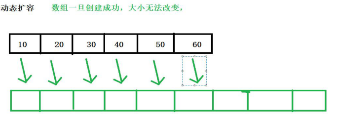
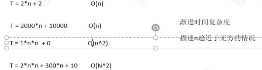
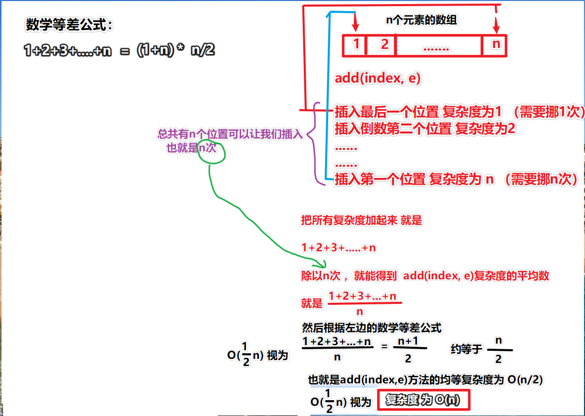

顺序表：底层采用的数组

顺序表存储元素物理空间一定是连续的

数组一旦创建成功，大小不能改变

创建了大小为1000的数组，里面放了3个元素，其余的997占用空间吗？答：占用。

#### 泛型

要让Array支持泛型 

`@param <E> E 代表元素类型 （常用E T V K）`

##### 步骤：

1. 在类名后面加 `<E>` --- 尖括号+泛型占位符

2. 声明数组的位置，使用 `E[]` 声明元素类型

3. 初始化时，<font color=#c00000>创建 Object数组，再转为 `E[]`，  `data = (E[]) new Object[capacity];`</font>

4. 之前使用的 `==` 判断两边是否相等，需要替换为 `.equals()` 来判断

   <font color=#c00000>因为 `==` 判断的是地址， `.equals` 判断的是值</font>

   当我们使用上面Object数组后，就只能使用引用类型（基础类型的包装类型），所以不能继续使用 `==` 判断

   ```java
           String s1 = new String("frank");
           String s2 = new String("frank");
           System.out.println(s1.equals(s2)); // true
           System.out.println(s1 == s2); // false
   ```

5. 删除元素后，<font color=#c00000>恢复初始值，要恢复成 null </font>，因为引用类型的初始值是null

6. 将所有元素类型 改为 `E`

```java
/**
 * 要让Array支持泛型
 *
 * @param <E> E 代表元素类型 （常用E T V K）
 */
public class Array<E> {
    // 数组（此数组内容中的元素不一定全都是Array的元素，因为此数组的长度是容量大小，未必与Array实例的size大小相等）
    private E[] data;
    // 元素个数（Array的真实长度）
    private int size;

    // 空参构造
    public Array() {
        // 初始化大小为10的容器
        this(10);
    }

    // 满参构造
    public Array(int capacity) {
        // new E[capacity]报错，原因：new 后跟的应该是类
        // 因为Object可以接收任何类型，所以
        // 创建一个Object类型的数组，然后将他的类型转换为E[]
        // 不过这样修改后，数组中元素只能存放引用类型
        data = (E[]) new Object[capacity];
        size = 0;
    }

    // 获取容量
    public int getCapacity() {
        return data.length;
    }

    // 获取元素个数
    public int getSize() {
        return size;
    }

    // 是否为空
    public boolean isEmpty() {
        return size == 0;
    }

    // 向数组中新增元素
    // 向index为2的位置新增元素
    public void add(int index, E e) {
        // 极端情况：
        // 数组满了
        if (size == data.length)
            throw new RuntimeException("数组已满，请先扩容");
        // 索引 < 0 或 索引 > size
        // 之所以判断 index > size 阻止添加，是因为即使data数组还有容量空间让我们添加，
        // 但是超过了Array的size，后面的元素添加是没有意义的
        if (index < 0 || index > size)
            throw new RuntimeException("索引非法");
        // 1. 挪, 从最后一位(size)开始往后挪元素，挪到新元素要插入的位置(index)
        for (int i = size - 1; i >= index; i--) {
            // size为0，index为0时，-1>=0不满足循环条件,不会进入循环，也就不需要挪，直接下一步进行添加
            data[i + 1] = data[i];
        }
        // 赋值
        data[index] = e;
        // 维护size
        size++;
    }

    // 专门在数组的头部添加：头插法
    public void addFirst(E e) {
        add(0, e);
    }

    // 专门在数组的尾部添加：尾插法
    public void addLast(E e) {
        add(size, e);
    }

    // 查找（1.根据索引查找值 2.根据值查找索引）
    // 1.根据索引查找值
    public E get(int index) {
        // index一定要在0 到 size-1的范围之内
        if (index < 0 || index >= size) {
            throw new RuntimeException("索引非法");
        }
        return data[index];
    }

    // 2.根据值查找索引 相当于以前的indexOf
    public int find(E e) {
        for (int i = 0; i < size; i++) {
            // 找到返回索引
//            if (data[i]==e){
//                return i;
//            }
            // 在java中==比较的是内存地址，equals比较的是值
            if (data[i].equals(e)) {
                return i;
            }
        }
        // 找不到返回 -1
        return -1;
    }

    // 修改
    public void set(int index, E e) {
        if (index < 0 || index >= size) {
            throw new RuntimeException("索引非法");
        }
        data[index] = e;
    }

    // 是否包含某个元素
    // 包含返回true 不包含返回false
    public boolean contains(E e) {
        for (int i = 0; i < size; i++) {
            if (data[i].equals(e)) {
                return true;
            }
        }
        return false;
    }

    // 删除元素（三个方法）
    // 1.删除指定位置的值
    public E remove(int index) {
        if (index < 0 || index >= size) {
            throw new RuntimeException("索引非法");
        }
        // 先记录好旧值
        E oldValue = data[index];
        // 挪
        for (int i = index + 1; i < size; i++) {
            data[i - 1] = data[i];
        }
        // 最后一位恢复初始值（引用类型初始值就是null）
        data[size - 1] = null;
        // 维护size
        size--;
        // 返回旧值
        return oldValue;
    }

    // 2.删除头部元素
    public E removeFirst() {
        return remove(0);
    }

    // 3.删除尾部元素
    public E removeLast() {
        return remove(size - 1);
    }


    @Override
//    public String toString() {
//        return "Array{" +
//                "data=" + Arrays.toString(data) +
//                ", size=" + size +
//                '}';
//    }
    public String toString() {
        String str = "[";
        // 其实这里应该用size，因为data.length实际上是跟着容量走的，
        // 所以打印出来的内容可能会包含 不属于Array实例中实际元素的默认值（0）
        // 暂时用data.length是为了看到元素的挪动
        for (int i = 0; i < data.length; i++) {
            str += data[i];
            if (i != data.length - 1) {
                str += ",";
            }
        }
        str += "]";
        return str;
    }
}
```

#### 动态扩容

需要一个新的更大的数组



```java
    /**
     * 扩容方法（可扩可缩）
     *
     * @param newCapacity 新容量
     */
    public void resize(int newCapacity) {
        // 创建新的数组
        E[] newData = (E[]) new Object[newCapacity];
        // 复制原来的元素
        for (int i = 0; i < size; i++) {
            newData[i] = data[i];
        }
        // 覆盖旧数组
        data = newData;
    }
```

添加时，容量已满，需要扩容

```java
        // 数组满了
        if (size == data.length){
            // 扩容
            // throw new RuntimeException("数组已满，请先扩容");
            // 扩容俩倍
            resize(data.length * 2);
        }
```

删除后，容量空闲半数以上，需要扩容

```java
    	// 缩容
        if (size == data.length / 2) {
            // 缩容一半
            resize(data.length / 2);
        }
```


## 复杂度分析

#### 作用：

评判、评估 一个算法的优劣

1. 时间复杂度：一段代码执行需要的时间（评估）
2. 空间复杂度：一段代码执行需要消耗的内存资源、硬盘资源、CPU资源、网络资源...

### 时间复杂度

是指<font color=#c900000>执行算法所需要的计算工作量</font>，用来<font color=#c900000>描述该算法的运行时间</font>

一般使用 **`大O`** 表示，常见的时间复杂度有：O(1)、O(n)、O(n^2)、O(n^3)、O(log^n).....

##### 全称：<font color=red>渐进</font> 时间复杂度 

(大O符号（Big O notation）就是用于描述函数渐进行为的数学符号)

##### 例如：

```java
public static int sum(int[] nums) {
	int sum = 0;
    for(int num:nums) sum+=num;
    return sum;
}
```

这段代码的时间复杂度就是 <font color=#ff00000>O(n)</font>

n代表 ***数据规模*** 也就是 `nums中元素的个数`， <font color=red>算法和n呈线性关系</font>

##### 用函数表达这段代码：

实际时间：<font color=red>`T = c1*n + c2`</font>

<font color=#cc0000>`c2`</font>：指 `int sum =0; ` + `return sum;` <font color=#cc0000>不受变量影响的这些时间</font>

<font color=#cc0000>`c1`</font>：指 `for(int num:nums) sum+=num;` <font color=#cc0000>受变量影响的时间</font>

当<font color=#ff00000>n趋于无穷大的时候，我们几乎可以忽略 `c2` 的时间，所以直接称为 O(n)</font>



通过上图可以看出：

* n如果不是趋于无穷大时， `O(n^2)` 不一定 大于 `O(n) `

* 但是如果n趋于无穷大时，`O(n^2)` 一定 大于 `O(n) `

#### 总结

* O(1)的时间复杂度：只能代表算法的执行，不受任何变量的影响，表示复杂度是常量级别的
* O(n)：例如：for循环
* O(n^2)：例如：嵌套for循环

#### 分析动态数组的时间复杂度

* 添加操作

  * `addLast(e)`： 需要扩容时O(n)，不需要扩容时O(1)

  * `addFirst(e)`：需要扩容时`O(2n)=>O(n)`，不需要扩容时O(n)

  * `add(index, e)`：不考虑扩容时 O(n/2)=O(n)，扩容时 `O(3n/2)=O(n)`

    

    

  最好时间复杂度：O(1)

  最坏时间复杂度：O(n) （<font color=red>通常以最坏时间复杂度为结果</font>）

* 删除操作

  * `E removeLast()`：需要缩容时O(n)，不需要缩容时O(1)
  * `E removeFirst()`：需要缩容时`O(2n)=>O(n)`，不需要缩容时O(n)
  * `E remove(index)`：O(n/2)=O(n)，同上面添加操作

  时间复杂度：O(n)

* 修改操作

  * `set(index, e)`：O(1)

* 查询操作

  * `get(index)`：O(1)
  * `contains(e)`：O(n)
  * `find(e)`：O(n)

##### 总结：

* 增删：O(n)

  因为时间复杂度一般是按照最坏结果来看，所以如果<font color=#c00000>只对最后一个元素操作，依然是O(n)</font>，因为有时需要扩容

* <font color=red>改查：已知索引 O(1) ，未知索引 O(n)</font>


#### 均摊时间复杂度 -- 扩容的复杂度分析

当我们新建一个容量为 10 的ArrayList时，使用 `addLast(e)` 向空数组里依次添加11个元素

第11次操作时，会触发 扩容方法 `resize()`（这次操作会有11次基本操作），所以总共进行了21次基本操作

平均下来，每次 `addLast(e)` ，进行2次基本操作，也就是 O(2) => O(1)

##### 假设 capacity = n，n+1次 `addLast(e)`，触发1次`resize()`扩容，总共进行 `2n+1` 次基本操作

##### 结论：

* `addLast`的均摊复杂度为O(1)
* `removeLast`的均摊复杂度为O(1)


#### 复杂度震荡

上面我们说了 `addLast()` 和 `removeLast()` 复杂度为 O(1)

但是，当我们的 <font color=red>capacity=n，size=n</font>时，我们<font color=red>来回进行 `addLast ` 和 `removeLast ` 操作</font>的时候


我们就会发现，<font color=red>每次操作 复杂度都在 O(n)</font>，因为<font color=red>每次都要扩容或缩容</font>，这就是<font color=red>复杂度震荡</font>

##### 原因：`removeLast` 的时候 resize() 缩容 过于着急

##### 解决方法：<font color=red> lazy</font>

当 size == capacity/4时，才将capacity减半缩容

```java
        // 缩容
        // 解决复杂度震荡问题
		// 还要保障缩容后不要小于基础容量10，所以data.length / 2 >= 10
        if (size == data.length / 4 && data.length / 2 >= 10) {
            // 缩容一半
            resize(data.length / 2);
        }
```

这样，就可以改善复杂度震荡问题。