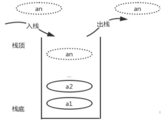
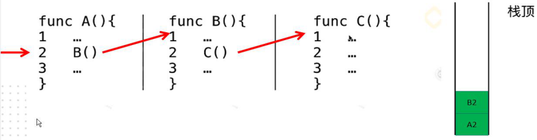

## 栈

### 栈的基本概念和特点

栈也是一种<font color=red>受限</font>的<font color=red>线性数据结构</font>

栈是<font color=red>仅允许</font>在<font color=red>表尾</font>进行插入、删除操作的特殊线性表

* <font color=red>允许</font>操作的表尾端称为<font color=red> “栈顶”</font>
* <font color=red>不允许</font>操作的一端称为<font color=red> “栈底”</font>

栈是 <font color=red>“后进先出” 的线性表（LIFO）</font>或  “先进后出” 的线性表（FILO：`First in Last out`）



### 应用场景

* 浏览器的前进后退

* 无处不在的Undo操作（`ctrl+z` 撤销）

* 程序调用的系统栈（方法互相调用）

  


### 栈的接口

1. 栈的判空操作：`isEmpty()` 
2. 栈的长度：`getSize()`
3. 取栈顶元素的操作：`peek()`
4. 入栈操作：`push()`
5. 出/弹栈操作：`pop()`

```java
// 规定栈接口
public interface IStack<E> {
    /**
     * 判断是否为空
     */
    boolean isEmpty();

    /**
     * 获取栈的元素的个数
     */
    int getSize();

    /**
     * 压栈、入栈
     */
    void push(E e);

    /**
     * 出栈
     */
    E pop();

    /**
     * 取栈顶元素
     */
    E peek();
}
```


### 栈的实现方式

1. 顺序栈 - 使用顺序表实现栈

   ```java
   public class ArrayListStack<E> implements IStack<E>{
       private Array<E> array;
   
       public ArrayListStack() {
           this.array = new Array<>();
       }
   
       public ArrayListStack(int capacity) {
           this.array = new Array<>(capacity);
       }
   
       @Override
       public boolean isEmpty() {
           return array.isEmpty();
       }
   
       @Override
       public int getSize() {
           return array.getSize();
       }
   
       @Override
       public void push(E e) {
           array.addLast(e);
       }
   
       @Override
       public E pop() {
           return array.removeLast();
       }
   
       @Override
       public E peek() {
           return array.getLast();
       }
   
       @Override
       public String toString() {
           return array.toString();
       }
   }
   
   ```

2. 链栈 - 使用链表实现栈


