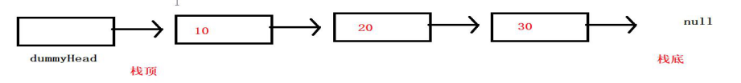
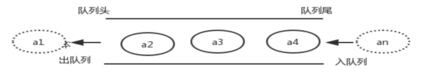
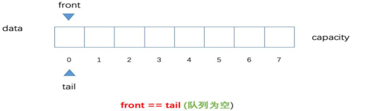
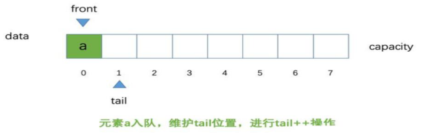
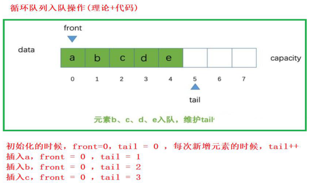
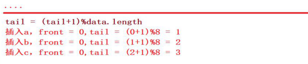
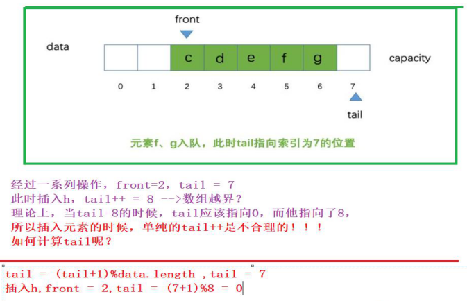
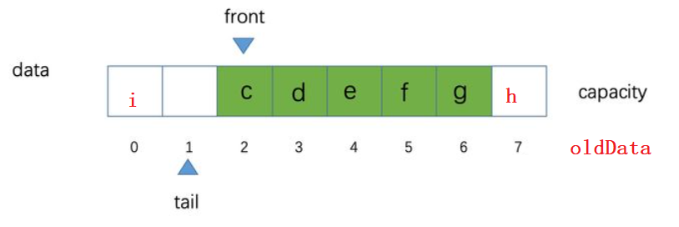
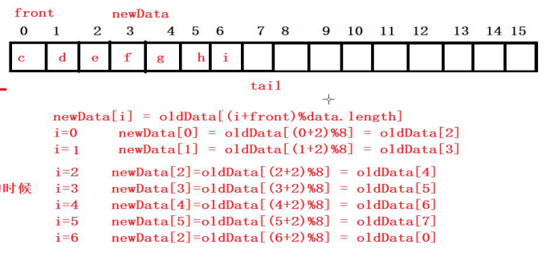
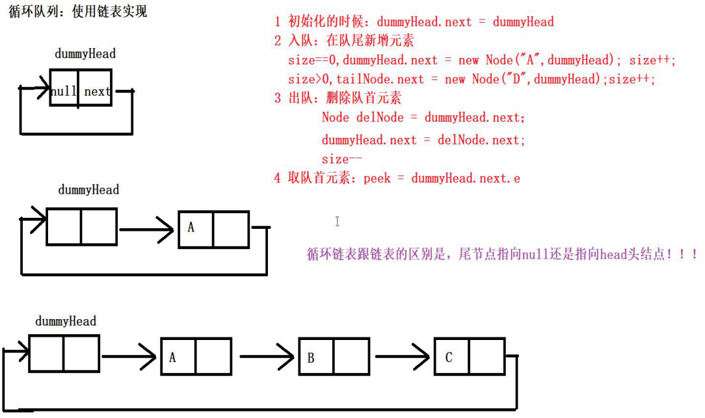

### 链栈

使用链表实现的栈



选择在 头结点 操作，复杂度会更低

```java
public class LinkedListStack<E> implements IStack<E> {
    private LinkedList<E> linkedList;

    public LinkedListStack() {
        this.linkedList = new LinkedList<>();
    }

    @Override
    public boolean isEmpty() {
        return linkedList.isEmpty();
    }

    @Override
    public int getSize() {
        return linkedList.getSize();
    }

    @Override
    public void push(E e) {
        linkedList.addFirst(e);
    }


    @Override
    public E pop() {
        return linkedList.removeFirst();
    }

    @Override
    public E peek() {
        return linkedList.getFirst();
    }

    @Override
    public String toString() {
        return linkedList.toString();
    }
}

```


## 队列

### 队列基本概念

也是一种受限的线性表

队列是只允许在表的一端进行插入，而在表的另一端进行删除操作的一种特殊线性表。

允许插入的一段称为 “队尾”，允许删除的一端称为 “队首”

队列是 “先进先出” 的线性表（FIFO）或 “后进后出” 的线性表（`LILO`）



#### 实现方式

* 用数组实现的队列叫作顺序队列

  ```java
  public class ArrayListQueue<E> implements IQueue<E> {
      private Array<E> arrayListQueue;
  
      public ArrayListQueue() {
          arrayListQueue = new Array<>();
      }
  
      @Override
      public boolean isEmpty() {
          return arrayListQueue.isEmpty();
      }
  
      @Override
      public int getSize() {
          return arrayListQueue.getSize();
      }
  
      @Override
      /**
       * 取队首
       */
      public E peek() {
          return arrayListQueue.getFirst();
      }
  
      @Override
      /**
       * 入队
       */
      public void enqueue(E e) {
          arrayListQueue.addLast(e);
      }
  
      /**
       * 出队
       * @return
       */
      @Override
      public E dequeue() {
         return arrayListQueue.removeFirst();
      }
  }
  ```

  

* 用链表实现的队列叫作链式队列

  ```java
  public class LinkedListQueue<E> implements IQueue<E> {
      private LinkedList<E> linkedList;
  
      public LinkedListQueue() {
         linkedList = new LinkedList<>();
      }
  
      @Override
      public boolean isEmpty() {
          return linkedList.isEmpty();
      }
  
      @Override
      public int getSize() {
          return linkedList.getSize();
      }
  
      @Override
      public E peek() {
          return linkedList.getFirst();
      }
  
      @Override
      public void enqueue(E e) {
          linkedList.addLast(e);
      }
  
      @Override
      public E dequeue() {
          return linkedList.removeFirst();
      }
  
      @Override
      public String toString() {
          return linkedList.toString();
      }
  
  ```

  

### 队列基本操作

* 队列的判空操作：`isEmpty()`
* 队列的长度：`getSize()`
* 取队首元素操作：peek()
* 入队操作：enqueue(e)
* 出队操作：dequeue()

```java
// 定义接口
public interface IQueue<E> {
    /**
     * 是否为空
     * @return
     */
    boolean isEmpty();

    /**
     * 获取长度
     * @return
     */
    int getSize();

    /**
     * 取队首
     * @return
     */
    E peek();

    /**
     * 入队
     * @param e
     */
    void enqueue(E e);

    /**
     * 出队
     * @return
     */
    E dequeue();
}
```


### 循环队列

#### 实现方式

* 顺序循环队列


#### 数组循环队列

队首出队时，循环队列时间复杂度为O(1) ， 普通队列时间复杂度为O(n)

#### 概念

使用front和tail分别来表示队首队尾。






#### 入队操作：

##### 分析：







tail每次的值应该要等于   <font color=red>tail上次值+1取余数组长度</font>

在循环队列中，我们会浪费一个空间， 当` (tail+1)%data.length == front` 的时候，就代表队列满了，就要扩容

```java
    @Override
    // 入队
    public void enqueue(E e) {
        // 判断是否需要扩容
        if ((tail +1 ) % data.length==front) {
            // 扩容
            throw new RuntimeException("请扩容");
        }
        // 将新元素添加到 tail 指定位置
        data[tail] = e;
        // 维护tail
        tail = (tail+1)%data.length;
        // 维护size
        size++;
    }
```


#### 扩容操作：

扩容时，新数组的 i 位置元素， 应该是 旧数组的 i + front 取余 旧数组长度 位置的元素

`+font` 是因为旧数组的 首元素是front，从旧数组的front开始拿

`%data.length` 是因为新数组的索引加上front可能超出原数组的索引，刚好取余后可以找到旧数组0开始的元素





```java
    /**
     * 重置容量
     * @param newCapacity 新容量
     */
    public void resize(int newCapacity) {
        // 创建新数组
        E[] newData = (E[]) new Object[newCapacity];
        // 挪动， 遍历新数组从头开始的位置，往进放对应的元素
        for (int i = 0; i < size; i++) {
            // 扩容时，新数组的 i 位置元素， 应该是 旧数组的 i + front 取余 旧数组长度 位置的元素
            newData[i] = data[(i+front)%data.length];
        }
        // 维护front  tail
        front = 0;
        tail = size;
        // 更新
        data = newData;
    }
```


#### 出队操作

```java
    @Override
    /**
     * 出队
     */
    public E dequeue() {
        // 判断队列中是否存在元素
        if (size == 0) {
            throw new RuntimeException("队列为空，无元素出队");
        }
        // 保存要出队的元素
        E del = data[front];
        // 维护front
        front = (front + 1) % data.length;
        // 维护size
        size--;
        // 是否缩容
        if (size == data.length / 4 && data.length / 2 >= 10) {
            resize(data.length / 2);
        }
        return del;
    }
```


### 使用链表实现循环队列



```java
public class LoopQueueByLinkedList<E> implements IQueue<E> {
    // 虚拟头结点
    Node dummyHead;
    // 大小
    int size;
    // 尾结点
    Node tailNode;

    // 使用内部类创建结点类
    private class Node {
        // 元素
        public E e;
        // 下一个节点
        public Node next;
        // 无参构造
        public Node() { }
        // 有参构造
        public Node(E e, Node next) {
            this.e = e;
            this.next = next;
        }

        @Override
        public String toString() {
            return e.toString();
        }
    }

    public LoopQueueByLinkedList() {
        dummyHead = new Node();
        dummyHead.next = dummyHead;
        size = 0;
    }

    @Override
    public boolean isEmpty() {
        return size == 0;
    }

    @Override
    public int getSize() {
        return size;
    }

    @Override
    public E peek() {
        return dummyHead.next.e;
    }

    // 入队
    @Override
    public void enqueue(E e) {
        if (size==0) {
            tailNode = new Node(e, dummyHead);
            dummyHead.next = tailNode;
        } else {
            tailNode.next = new Node(e, dummyHead);
            tailNode = tailNode.next;
        }
        size++;
    }

    // 出队
    @Override
    public E dequeue() {
        if (size ==0) {
            throw new RuntimeException("无元素");
        }
        Node delNode = dummyHead.next;
        dummyHead.next = delNode.next;
        return delNode.e;
    }
}
```

