# 树

### 概念

树是由n个结点所构成的有限集合，当n=0时，称为空树，当n>0时，n个结点满足以下条件：

* 有且仅有一个称为根的结点
* 除了根结点以外，每个结点只有一父结点
* 其余结点可分为m个互不相交的有限集合，且每一个集合又构成一棵树，这棵树称为是根结点的子树

### 特点

* 每个结点都只有有限个子结点或无子结点
* 没有父结点的结点称为根结点
* 每一个非根结点有且只有一个父结点
* 除了根结点外，每个子结点可以分为多个不相交的子树
* 树里面没有环路

### 树的结点：

树中的每个元素我们叫做 “结点”，用来连线相邻结点之间的关系，我们叫做“父子关系”

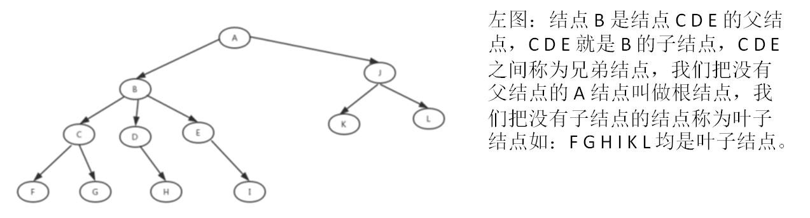 

### 常用术语：

##### 分支：根和子树根之间的连线（边）

结点：数据元素

结点的路径：由从根到该结点所经分支和节点构成

结点的度：结点所拥有子树的数目

树的度：树中所有结点的度的最大值

叶子结点：度为零的结点

分支结点：度大于零的结点

#### 节点关系的常用术语：

孩子结点，双亲结点，兄弟结点，堂兄弟结点，祖先结点，子孙结点

#### 层次和深度：

##### 结点的层次：

规定根结点的层次为0，则其它结点的层次是其双亲结点的层次数加1

##### 树的深度：

树中所有结点层次数的最大值加1

#### 森林：

由 `m(m>=0)` 颗互不相交的树所构成的集合，就是森林

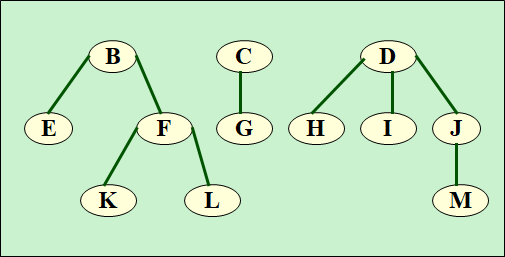 

#### 重点常用术语

高度（Height），深度（Depth），层（Level）

结点的高度：结点到叶子结点的最长路径（边数），所有叶子结点的高度为0

结点的层次：规定根的层次为0，其余由父结点层次+1

结点的深度：层次+1

树的高度：根结点的高度

## 二叉树

树的度不超过2的树都叫做二叉树

每个结点最多有两个子结点，分别是左子结点和右子结点。

不过，二叉树并不要求每个结点都有两个子结点，有的结点只有左子结点，有的结点只有右子结点也可以

二叉树也可以是空树

#### 二叉树的五种基本形态

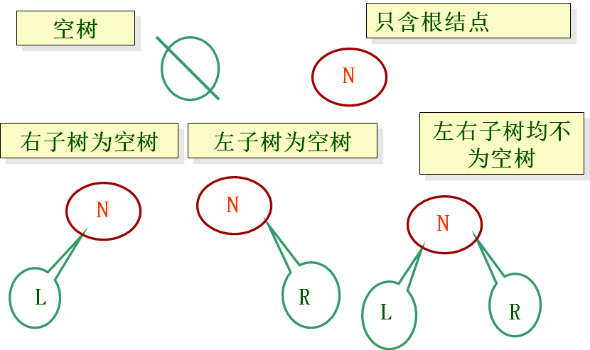 

### 满二叉树

叶子结点全都在最底层，除了叶子结点之外，每个结点都有左右两个子结点，这种二叉树就叫作满二叉树

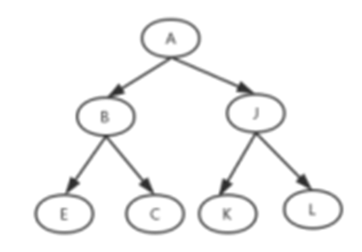 

### 完全二叉树

叶子结点都在最底下两层，最后一层的叶子结点都靠左排列，并且除了最后一层，其他层的结点个数都要达到最大，这种二叉树叫作完全二叉树。

最后一个叶子结点前不能有空结点

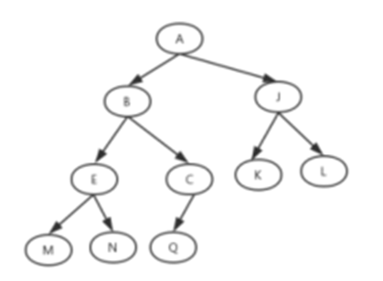 

### 单分支树

#### 左支树

所有结点都没有右子结点的二叉树

#### 右分支树

所有结点都没有左子结点的二叉树

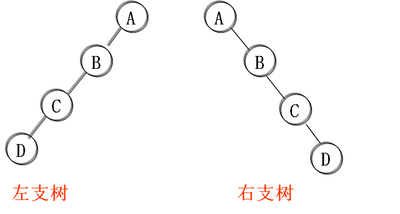 

### 二叉树的性质

* 在二叉树的第 `i` 层上至多有 2个结点

* 深度为 `h (h>=1)` 的二叉树上至多含 `2^h-1`的节点

* 对于任何一颗二叉树，若其叶结点的个数为 `n0`，度为2的结点个数为`n2`，则 `n0=n2+1`

* 具有n个结点的完全二叉树的深度为 `log2(n)+1`向下取整  或`log2(n+1)`向上取整

* 完全二叉树可以使用数组存储

  若对含`n`个结点的完全二叉树从上到下且从左到右进行 0 至 n-1 的编号，则队完全二叉树中任意一个编号为i的结点，有：

  * 若 `i=0`
  * 若 `2i+1>=n`
  * 若 `2i+2>=n`

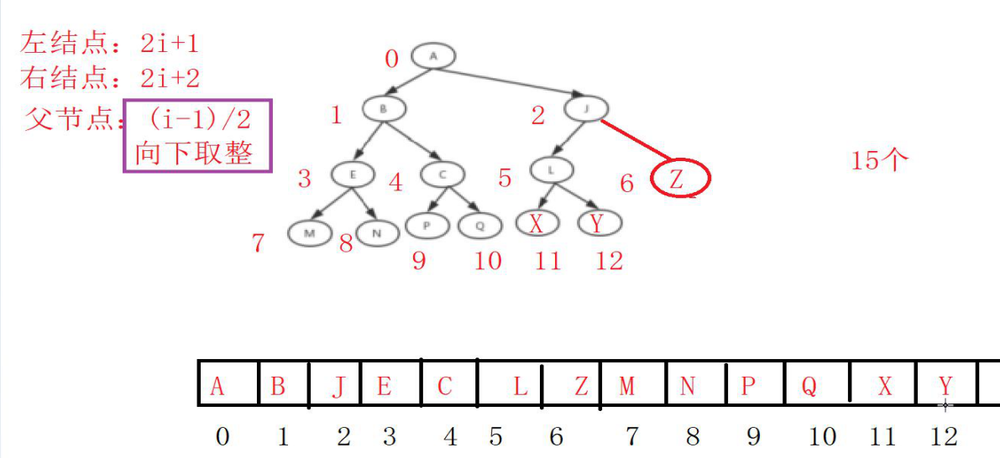

### 二叉树的存储结构

#### 顺序存储结构

只适用 满二叉树或者完全二叉树

##### 非完全二叉树的顺序存储结构：

先在树中增加一些并不存在的虚拟结点，并使其成为一颗完全二叉树，然后用与完全二叉树相同的方法对结点进行编号，再将编号为i的结点的值存放到数组下标为i的数组单元中，虚拟结点中不存放任何值。

#### 链式存储结构

* 二叉链表

  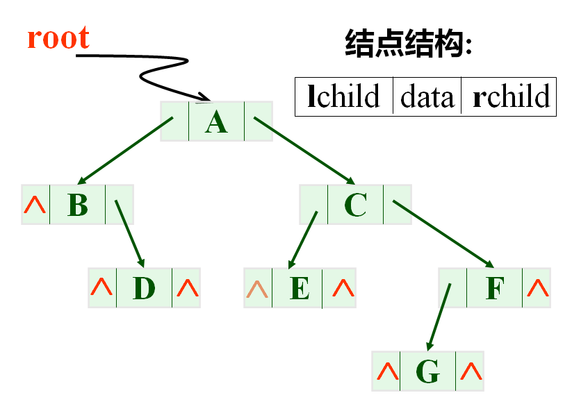 

* 三叉链表：标记父结点

  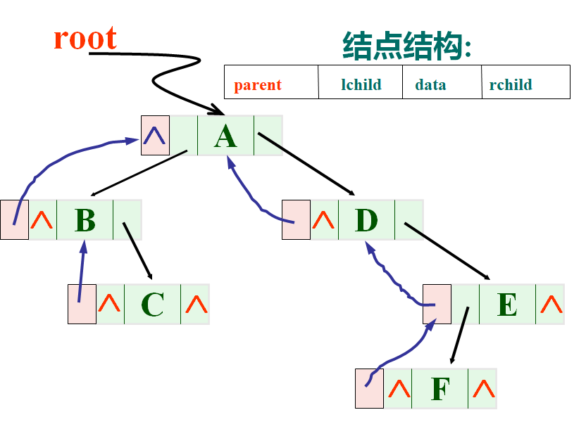 

### 遍历方法

#### 层次遍历方法

若二叉树为空，则为空操作。否则，按自上而下先访问第0层的根结点，然后再从左到右依次访问层次中的每一个结点。

#### 先根遍历方法

1. 访问根结点
2. 先根遍历左子树
3. 先根遍历右子树

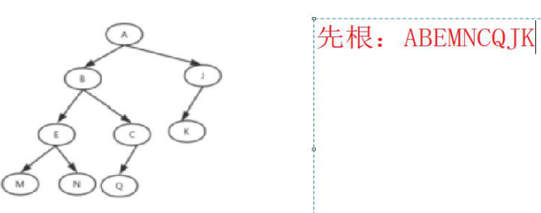

#### 中根遍历

1. 中根遍历左子树
2. 访问根结点
3. 中根遍历右子树

#### 后根遍历

1. 后跟遍历左子树
2. 后根遍历右子树
3. 访问根结点

#### 例题：

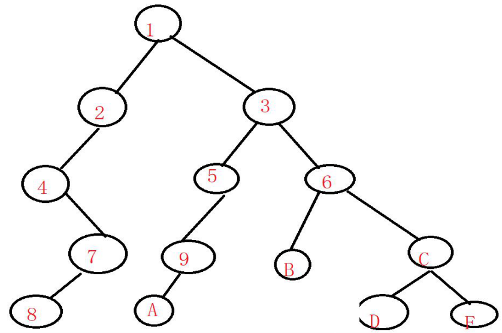 

先根遍历：`12478359A6BCDF`

中根遍历：`48721A953B6DCF`

后根遍历：`8742A95BDFC631`