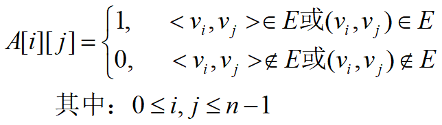
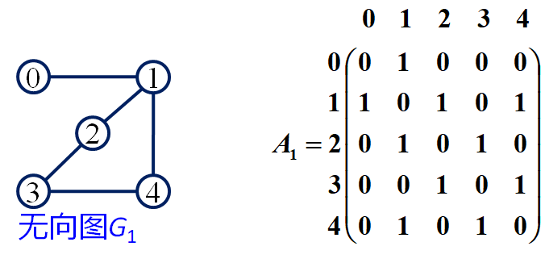
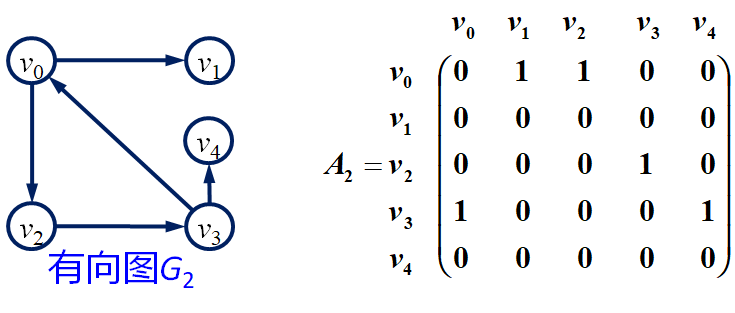
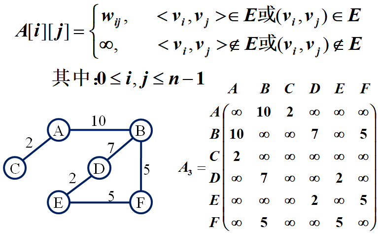

## 图的存储结构

### 图的邻接矩阵

* 用来表示顶点之间相邻关系的矩阵
* 假设图`G=(V, E)` 具有 `n(n>=1)` 个顶点，顶点的顺序依次为 `{v0,v1,v2,....,vn-1}` ，则图的邻接矩阵A是一个n阶方阵

 

#### 无向图的邻接矩阵

 

* 无向图的邻接矩阵是对称的（可采用上/下三角，压缩存储）
* 顶点vi的度是第i行或第i列中"1"的个数

#### 有向图的邻接矩阵

 

* 有向图的邻接矩阵不一定为对称矩阵
* 每一行中 "1" 的个数为该顶点的出度，每一列中"1"的个数为该顶点的入度

### 网的邻接矩阵

 

### 邻接表

* 是图的一种链式存储方法
* 由一个顺序存储的顶点表和 n个链式存储的边表组成的
* 顶点表由顶点或结点组成
* 边表是由边（或弧）结点组成的一个单链表，表示所有依附于顶点vi的边（对于有向图就是所有以vi为始点的弧）

#### 无向图

* 无向图对应的邻接表某行上边结点个数为该行表示结点的度
* 如果无向图（网）中有e条边，则对应邻接表有2e个边结点

#### 有向图

* 有向图对应的邻接表某行上边结点个数为该结点的出度

##### 注意：

* 在有向图的邻接表中不易找到指向该顶点的弧度