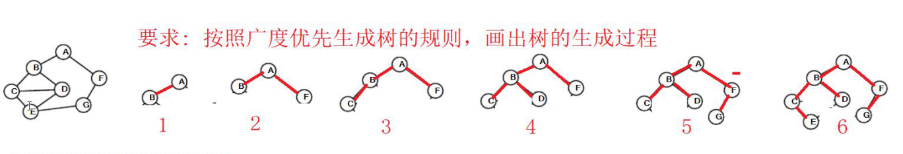

## 图的遍历

从图中的某个顶点出发，对图中的所有顶点访问且访问一次的过程

### 广度优先搜索

访问一个结点，再将这个结点相关联的其余节点依次访问完

* 从图中的某个顶点v开始，先访问该顶点再依次访问该顶点的每一个未被访问过的邻接点 `w1、w2、...`
* 然后按此顺序访问顶点 `w1、w2、...` 的各个还未被访问过的邻接点
* 重复上述过程，直到图中的所有顶点都被访问过为止
* 图的广度优先搜索遍历类似于树的层次遍历过程

### 深度优先搜索

从图中某个顶点 `V0` 出发，访问此顶点，然后依次从`V0`的各个未被访问的邻接点出发深度优先搜索遍历图，直至图中所有和`V0`有路径相通的顶点都被访问到。

#### 注意：

* 对于一个图，从某个顶点出发可得到多种搜索遍历结果，但如果是在特定存储结构上，按照某种特定搜索算法只能有一种唯一的遍历结果

## 最小生成树

在一个网的所有生成树中，权值总和最小的生成树称为最小代价生成树

### 构造最小生成树的准则

* 只能使用该图中的边构造最小生成树
* 当且仅当使用 `n-1` 条边来连接图中的 n个顶点
* 不能使用产生回路的边

### 连通图的生成树

* 是图的极小连通子图，它包含图中的全部顶点
* 是图的极大无回路子图，它的边集是关联图中所有顶点 而 又没有形成回路的边
* 一个有 n个顶点的连通图的生成树只能有 n-1 条边
* 图的生成树不是唯一的

#### 广度优先生成树

#### 深度优先生成树

### 习题

