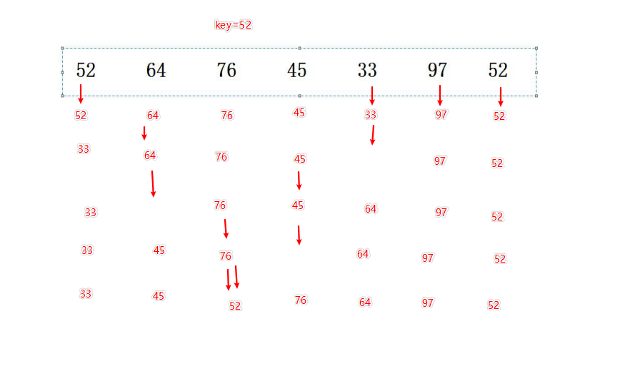
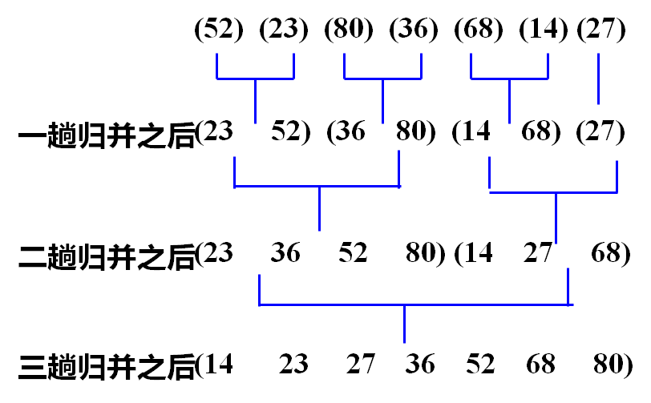
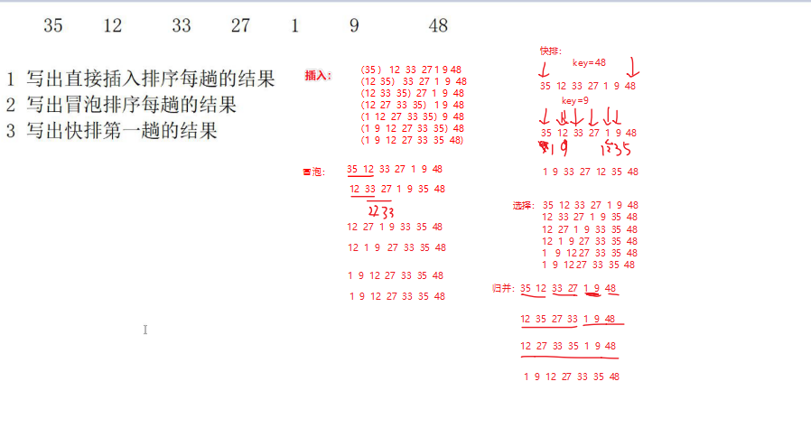

# 排序

## 直接插入排序

#### 思想：

每次将一个待排序的记录，按其关键字值的大小插入到前面已排序好的记录序列中的适当位置，直到全部记录插入完成为止。

## 交换排序

### 冒泡排序

1. 比较相邻的元素，如果第一个比第二个大，就交换他们两个
2. 对每一对相邻元素做同样的工作，从开始第一对到结尾的最后一对。在这一点，最后的元素应该会是最大的数
3. 针对所有的元素重复以上的步骤，除了最后一个
4. 持续每次对越来越少的元素重复上面的步骤，直到没有任何一对数字需要比较

### 快速排序

#### 取第一个开始排

## 直接选择排序

每一次从待排序的数据元素中选出最小（或最大）的一个元素，存放在序列的起始位置，直到全部待排序的数据元素排完

## 归并排序

将两个或两个以上的有序子序列 “归并” 为一个有序序列

### 二路归并

 

## 各种排序方法的综合比较

| 排序法   | 最坏所需时间 | 平均时间  | 稳定性 | 所需辅助空间 |
| -------- | ------------ | --------- | ------ | ------------ |
| 直接插入 | O(n2)        | O(n2)     | Yes    | O(1)         |
| 冒泡排序 | O(n2)        | O(n2)     | Yes    | O(1)         |
| 快速排序 | O(n2)        | O(nlog2n) | No     | O(log2n)     |
| 选择排序 | O(n2)        | O(n2)     | No     | O(1)         |
| 归并排序 | O(nlog2n)    | O(nlog2n) | Yes    | O(n)         |

